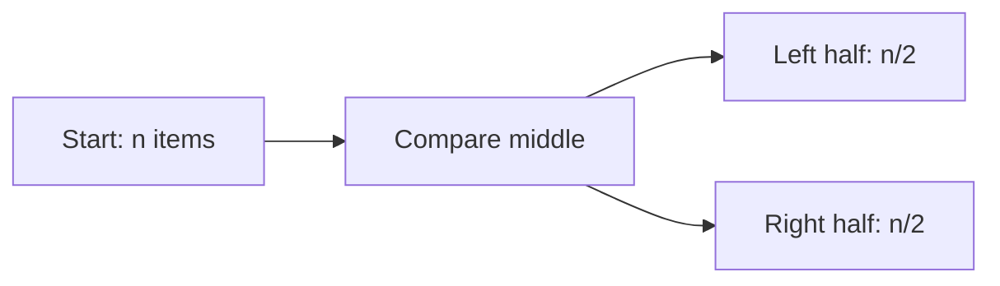
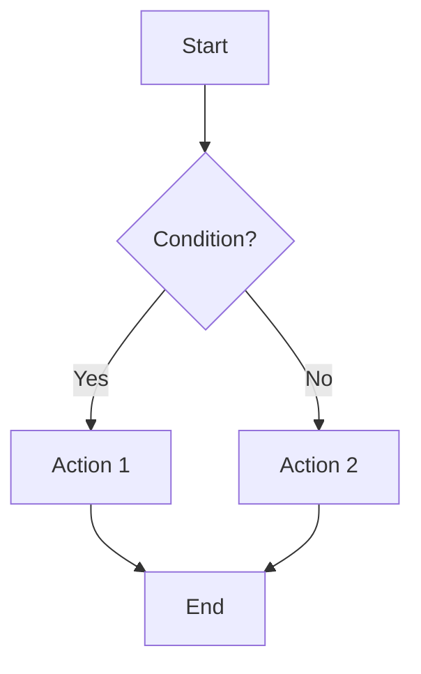
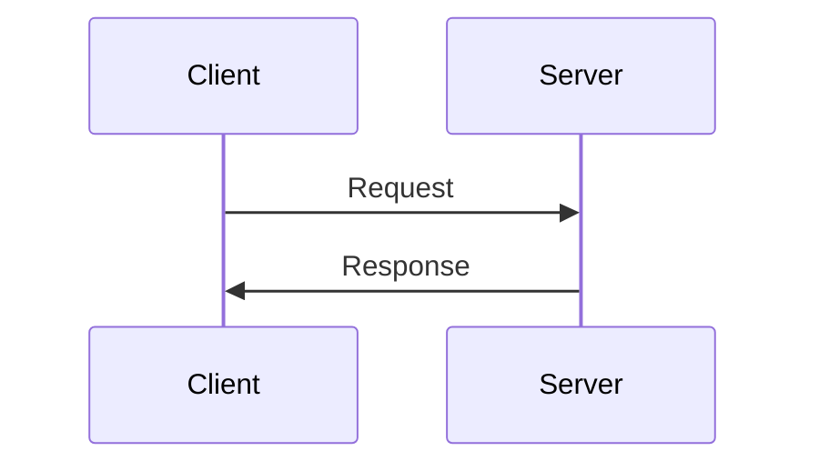
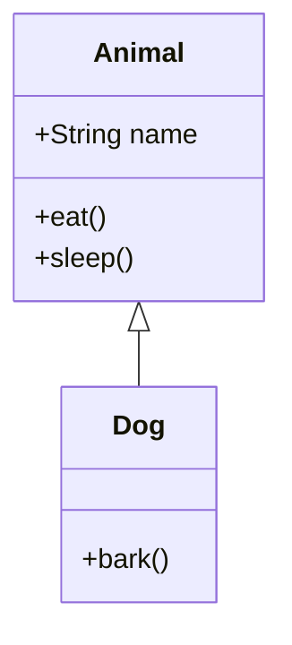
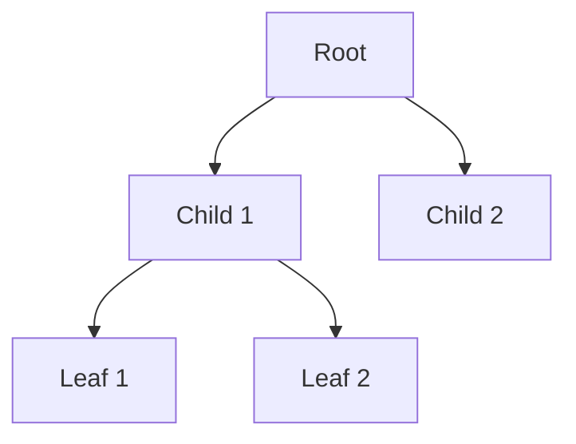
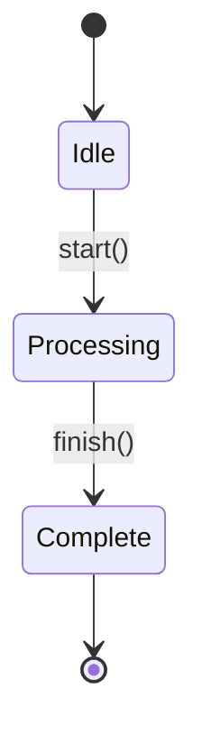

# AI Agent Writing Guidelines - STRICTLY FOLLOW

## CRITICAL RULES (Mandatory for All Agents)

### 1. Language and Tone

**REQUIRED STANDARDS:**

- Write at **bachelor's degree level** (BSc.CSIT standards)
- Use **simple, clear words** - avoid jargon unless necessary
- Explain technical terms when first introduced
- Write as if explaining to a smart student, not a professor
- **NEVER use vague statements** like "and so on", "etc.", "as mentioned before" without specific reference
- **NEVER over-explain** - be concise but complete

**FORBIDDEN:**

- ❌ NO unnecessary emojis in headings, topics, or technical content
- ❌ NO complex academic vocabulary when simple words work
- ❌ NO vague references - always be specific
- ❌ NO incomplete explanations - finish what you start
- ❌ NO overly verbose explanations - respect the student's time

**EXAMPLES:**

✅ **GOOD:**

````markdown
## Algorithm Analysis

Time complexity measures how running time grows with input size.

**Example:** Binary Search

- Input size: n elements
- Time complexity: O(log n)
- Reason: Halves the search space in each step


````

````

❌ **BAD:**
```markdown
## 🎯 Algorithm Analysis 🚀

Time complexity is basically like how the algorithm performs and stuff, you know, when the input gets bigger and all that, it's important for understanding performance and optimization, etc.

Example: Binary search is efficient because it uses divide and conquer and reduces the problem size significantly, as mentioned earlier.
````

### 2. Diagrams and Visual Aids

**MANDATORY:** Use GitHub-Flavored Mermaid diagrams wherever possible

**When to use Mermaid:**

- Flowcharts for algorithms
- Sequence diagrams for processes
- Class diagrams for relationships
- Graphs for data structures
- State diagrams for system states

**Mermaid Syntax Examples:**

**Flowchart:**



**Sequence Diagram:**



**Class Diagram:**



**Graph (for trees/graphs):**



**State Diagram:**



### 3. Examples Requirement

**MANDATORY:** Provide concrete examples for EVERY concept

**Example Structure:**

1. State the concept
2. Give a simple example
3. Show code/formula if applicable
4. Explain the example step-by-step

**GOOD Example Format:**

````markdown
### Merge Sort

Merge sort divides the array into halves, sorts each half, then merges them.

**Example:** Sort [38, 27, 43, 3]

**Step 1:** Divide

- Left: [38, 27]
- Right: [43, 3]

**Step 2:** Divide again

- [38], [27], [43], [3]

**Step 3:** Merge pairs

- [27, 38], [3, 43]

**Step 4:** Final merge

- [3, 27, 38, 43]

**Code:**

```python
def merge_sort(arr):
    if len(arr) <= 1:
        return arr

    mid = len(arr) // 2
    left = merge_sort(arr[:mid])
    right = merge_sort(arr[mid:])

    return merge(left, right)
```
````

**Time Complexity:** O(n log n)

- Dividing: log n levels
- Merging: n operations per level

````

### 4. File Linking

**MANDATORY:** Properly link related files and sections

**Link Format:**
```markdown
<!-- Internal link to section -->
See [Chapter Analysis](#chapter-wise-analysis) for details.

<!-- Link to another file in same subject -->
Refer to [detailed answers](./G5.md#chapter-1) in G5.md.

<!-- Link to another subject -->
Similar to [DAA sorting concepts](../DAA/imp_qtns/CS4.5.md#sorting).

<!-- Link to external reference -->
Format reference: [4th Semester DBMS](https://github.com/aakku106/4thSem_impQtns/tree/main/DBMS/imp_qtns/2DayPrep)
````

**Cross-Reference Rules:**

- Link to specific sections with #anchors
- Use relative paths for internal links
- Verify all links work before finalizing
- Mention related concepts with links

### 5. Word Count and Content Density

**Per Agent Requirements:**

| Agent             | File              | Min Words | Max Words | Focus                 |
| ----------------- | ----------------- | --------- | --------- | --------------------- |
| Claude Sonnet 4.5 | CS4.5.md          | 5000      | 7000      | Strategic analysis    |
| GPT-5             | G5.md             | 8000      | 12000     | Detailed explanations |
| Gemini 2.5 Pro    | G2.5_p.md         | 4000      | 6000      | Visual materials      |
| Gemini 3 Pro      | survival_guide.md | 2000      | 3000      | Emergency prep        |

**Content Density Rules:**

- NO filler content
- Every paragraph must add value
- Remove redundancy
- Use bullet points for lists
- Use tables for comparisons
- Use diagrams for processes

### 6. Quality Standards

**REQUIRED for EVERY output:**

✅ **Completeness:**

- Answer covers all required points
- No "to be continued" or incomplete sections
- All examples fully worked out

✅ **Clarity:**

- Simple words (bachelor level)
- Short sentences (15-20 words average)
- Clear structure with headings

✅ **Accuracy:**

- Technical correctness verified
- Examples tested/validated
- Formulas/code syntax correct

✅ **Usefulness:**

- Practical for exam preparation
- Actionable advice
- Real value for students

### 7. Agent-Specific Guidelines

#### Claude Sonnet 4.5 (CS4.5.md)

**Your Mission:** Strategic pattern recognition and prioritization

**Must Include:**

- Frequency analysis across 7 years
- Importance scoring with formula
- Study plans (30/15/7/2 days)
- Chapter-wise priority rankings
- Expected marks distribution

**Writing Style:**

- Analytical and data-driven
- Clear priority markers (High/Medium/Low)
- Specific time allocations
- Practical study advice

**Diagram Requirements:**

- Frequency heat maps
- Priority matrices
- Study timeline flowcharts

#### GPT-5 (G5.md)

**Your Mission:** Comprehensive, detailed explanations

**Must Include:**

- Full answers to all high-priority questions
- Step-by-step solutions
- Multiple examples per concept
- Practice problems with solutions
- Quick revision notes

**Writing Style:**

- Teaching-oriented
- Simple explanations of complex topics
- Lots of examples
- Student-friendly tone

**Diagram Requirements:**

- Algorithm flowcharts
- Process sequences
- Concept relationships
- Worked examples visually

#### Gemini 2.5 Pro (G2.5_p.md)

**Your Mission:** Visual learning materials

**Must Include:**

- Mind maps for each chapter
- 50-60 flashcards
- One-page summaries
- Comparison tables
- Quick reference cards

**Writing Style:**

- Concise and scannable
- Visual-first approach
- Bullet points preferred
- Table-heavy format

**Diagram Requirements:**

- Concept maps for every chapter
- Comparison diagrams
- Memory aid visuals
- Quick reference charts

#### Gemini 3 Pro (survival_guide.md)

**Your Mission:** Emergency 2-day preparation

**Must Include:**

- Hour-by-hour schedule (Day 1 & 2)
- Must-memorize content list
- Question selection strategy
- Guaranteed 35+ marks path

**Writing Style:**

- Urgent and direct
- No fluff or filler
- Action-oriented
- Confidence-building

**Diagram Requirements:**

- Timeline visualization
- Priority flowchart
- Decision tree for question selection

### 8. Resource and Time Allocation

**IMPORTANT:** Take as much time and resources as needed

**You are ALLOWED to:**

- ✅ Take extra time for quality
- ✅ Use more computational resources
- ✅ Iterate multiple times for perfection
- ✅ Research thoroughly before writing
- ✅ Revise and improve drafts

**You are EXPECTED to:**

- 🎯 Produce high-quality, accurate content
- 🎯 Meet ALL requirements in these guidelines
- 🎯 Verify all examples and code
- 🎯 Ensure all diagrams render correctly
- 🎯 Check all links work

**Priority:** Quality > Speed

### 9. Verification Checklist

Before submitting your output, verify:

- [ ] No emojis in headings or topics
- [ ] Simple, bachelor-level language used
- [ ] No vague statements (etc., and so on)
- [ ] Not over-explained or verbose
- [ ] Mermaid diagrams included where applicable
- [ ] Every concept has at least one example
- [ ] All code/formulas syntax-checked
- [ ] All internal links work
- [ ] Word count within target range
- [ ] All required sections present
- [ ] Tables properly formatted
- [ ] Diagrams render correctly
- [ ] Cross-references accurate
- [ ] Content adds real value

### 10. Formatting Standards

**Headings:**

```markdown
# Main Title (no emojis)

## Major Section

### Sub-section

#### Minor point
```

**Lists:**

```markdown
**Ordered for steps:**

1. First step
2. Second step
3. Third step

**Unordered for features:**

- Feature 1
- Feature 2
- Feature 3
```

**Tables:**

```markdown
| Column 1 | Column 2 | Column 3 |
| -------- | -------- | -------- |
| Data 1   | Data 2   | Data 3   |
| Data 4   | Data 5   | Data 6   |
```

**Code Blocks:**

````markdown
```python
def example():
    return "Use language tags"
```
````

**Emphasis:**

```markdown
**Bold** for important terms
_Italic_ for emphasis (use sparingly)
`code` for inline code/technical terms
```

---

## Summary: The 3 Golden Rules

1. **SIMPLE WORDS** - Bachelor level, not PhD level
2. **SHOW, DON'T TELL** - Examples and diagrams always
3. **NO FLUFF** - Every word must add value

---

**Remember:** These are NOT suggestions - they are MANDATORY requirements. Your output will be rejected if it doesn't follow these guidelines.

---

Document Version: 1.0  
Last Updated: November 30, 2025  
Status: MANDATORY - All Agents Must Follow
