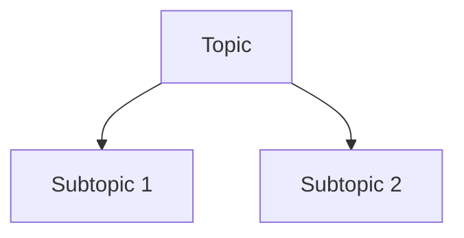
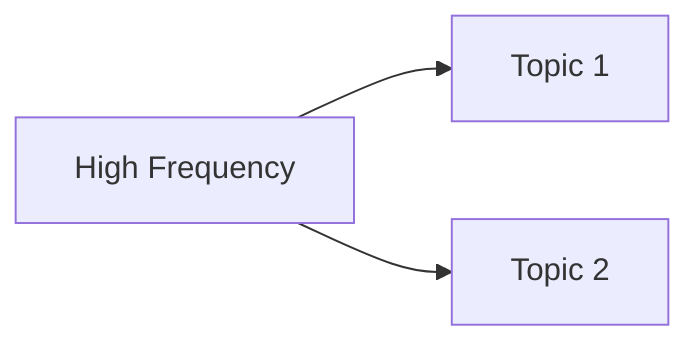

# PROMPT: Generate CS4.5.md (Strategic Analysis)

## Your Task

Generate a strategic exam analysis file for the specified subject.

**Subject:** [USER WILL SPECIFY - e.g., "Cryptography" or "Cripto"]

**Your Role:** You are Claude Sonnet 4.5, creating strategic analysis.

---

## What to Do

### Step 1: Read All Materials

Read from `/Users/aakku/Desktop/5th_sem/[SUBJECT]/qtn_sets_and_syllabus/`:

- syllabus.md (course structure)
- All question paper .md files (2076, 2078, 2079, 2080, 2081, and any additional papers)
- modelQtn.md (if available)

### Step 2: Analyze Frequency

For each topic in the syllabus:

1. Count how many times it appears across all papers
2. Note which years it appeared
3. Calculate importance score: (Frequency × 0.4) + (Marks × 0.3) + (Recency × 0.3)

### Step 3: Create Strategic Analysis

Generate a file with these sections:

1. **Executive Summary**

   - Total papers analyzed
   - Total questions count
   - High-priority topics count
   - Exam pattern

2. **Frequency Analysis by Unit**

   - For each syllabus unit:
     - Frequency score
     - High-frequency topics with counts
     - Question patterns (use Mermaid diagrams)
     - Expected marks
     - Study priority

3. **Strategic Study Recommendations**

   - Critical topics (5+ appearances)
   - High-priority topics (3-4 appearances)
   - Medium-priority topics (2 appearances)
   - Low-priority topics (1 appearance)

4. **Study Plans**

   - 30-day complete preparation
   - 15-day crash course
   - 7-day intensive strategy
   - 2-day survival strategy

5. **Question Selection Strategy**

   - Section-wise analysis
   - Pattern recognition
   - Recommended selections

6. **Common Mistakes to Avoid**

7. **Mark Distribution Analysis**

8. **Final Exam Day Tips**

9. **Confidence-Building Checklist**

10. **Success Metrics**

### Step 4: Follow Writing Rules

**MUST follow these rules** (from AGENT_GUIDELINES.md):

- Use simple, bachelor-level language
- NO emojis in headings
- Include Mermaid diagrams for patterns
- Provide concrete examples
- Be specific (no "etc.", "and so on")
- Word count: 5000-7000 words

---

## Output Format

Save as: `/Users/aakku/Desktop/5th_sem/[SUBJECT]/imp_qtns/CS4.5.md`

Start with:

```markdown
# [Subject Name] - Strategic Exam Analysis by Claude Sonnet 4.5

## Executive Summary

**Papers Analyzed:** [count]
**Total Questions:** [count]
**High-Priority Topics:** [count]
**Coverage:** [Excellent/Good/Limited]
...
```

---

## Mermaid Diagram Examples

Use these diagram types:

**Flowchart:**



**Graph:**



---

## Example Output Structure

```markdown
# Cryptography - Strategic Exam Analysis by Claude Sonnet 4.5

## Executive Summary

[Statistics and overview]

## Frequency Analysis by Unit

### Unit 1: Classical Ciphers

**Frequency Score: HIGH** (6/7 papers)
**High-Frequency Topics:**

1. Playfair Cipher (5 appearances)
2. Hill Cipher (4 appearances)
   [Include Mermaid diagram]

### Unit 2: Symmetric Ciphers

[Similar structure]

## Strategic Study Recommendations

[Critical, High, Medium, Low priority lists]

## Study Plans

[30-day, 15-day, 7-day, 2-day plans]

[Continue with all sections...]
```

---

## Ready?

**Confirm subject name and begin generating CS4.5.md file.**

Example: "Generate CS4.5.md for Cryptography"
