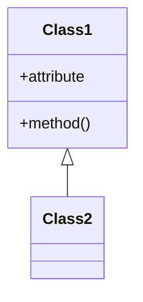
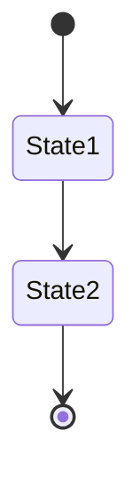
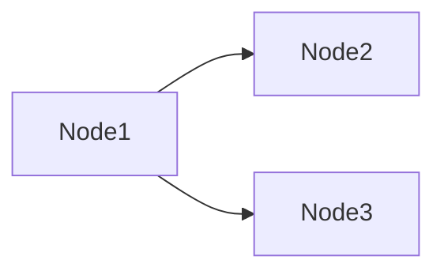
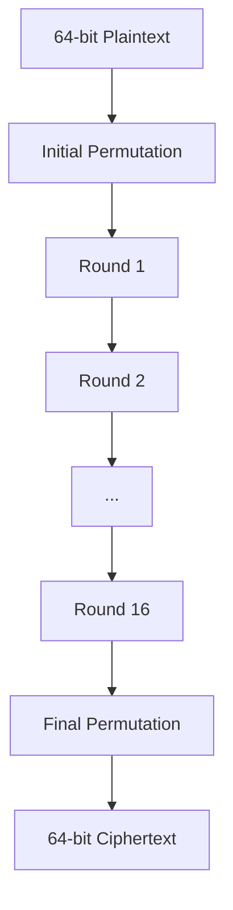
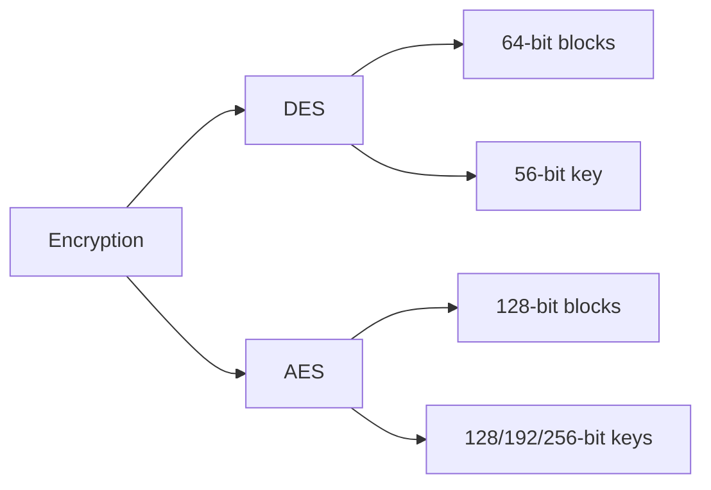

# PROMPT: Generate G2.5_p.md (Visual Materials)

## Your Task

Generate visual learning materials with diagrams for the specified subject.

**Subject:** [USER WILL SPECIFY]

**Your Role:** You are Gemini 2.5 Pro, creating visual references.

---

## What to Do

### Step 1: Identify Visual Topics

From the syllabus and questions, identify topics that benefit from:

- Flowcharts (processes, algorithms)
- Sequence diagrams (protocols, steps)
- Class diagrams (structures, relationships)
- State diagrams (systems, states)
- Tables (comparisons, properties)
- Graphs (hierarchies, trees)

### Step 2: Create Visual Content

For each topic:

1. Create Mermaid diagram
2. Add brief explanation
3. Provide quick reference table
4. Include key points

---

## Output Structure

````markdown
# [Subject Name] - Visual Materials by Gemini 2.5 Pro

## Quick Reference Guide

**Purpose:** Visual learning and fast revision  
**Diagrams:** [count]  
**Topics Covered:** [count]

## Unit 1: [Unit Name]

### [Topic Name]

**Concept:**
[Brief 2-3 line explanation]

**Visual Representation:**

```mermaid
[diagram here]
```
````

**Quick Reference Table:**

| Aspect | Detail |
| ------ | ------ |
| Key 1  | Value  |
| Key 2  | Value  |

**Key Points:**

- Point 1
- Point 2
- Point 3

---

[Repeat for all topics]

## Comparison Charts

### [Comparison Topic]

**Mermaid Comparison:**

```mermaid
[comparison diagram]
```

**Table Format:**

| Feature | Option A | Option B |
| ------- | -------- | -------- |
| Speed   | Fast     | Slow     |
| ...     | ...      | ...      |

## Algorithm Flowcharts

[Visual representations of key algorithms]

## Quick Revision Section

[Summary tables and one-page references]

````

---

## Diagram Types to Use

### 1. Flowchart
```mermaid
flowchart TD
    A[Start] --> B{Decision}
    B -->|Yes| C[Action 1]
    B -->|No| D[Action 2]
````

### 2. Sequence Diagram

```mermaid
sequenceDiagram
    A->>B: Request
    B->>C: Process
    C->>B: Response
    B->>A: Result
```

### 3. Class Diagram



### 4. State Diagram



### 5. Graph



---

## Writing Rules

**MUST follow:**

- Simple explanations
- NO emojis in headings
- Focus on visuals over text
- Every major topic needs diagram
- Tables for comparisons
- Word count: 4000-6000 words

---

## Example Output

````markdown
## Unit 2: Encryption Algorithms

### DES Structure

**Concept:**
DES uses Feistel structure with 16 rounds of encryption.

**Visual Representation:**


````

**Quick Reference Table:**

| Parameter  | Value                    |
| ---------- | ------------------------ |
| Block size | 64 bits                  |
| Key size   | 56 bits (64 with parity) |
| Rounds     | 16                       |
| Structure  | Feistel                  |

**Key Points:**

- Uses substitution and permutation
- Feistel structure allows same algorithm for encryption/decryption
- Each round uses different subkey
- S-boxes provide confusion

---

### DES vs AES Comparison

**Visual Comparison:**



**Comparison Table:**

| Feature    | DES     | AES              |
| ---------- | ------- | ---------------- |
| Block Size | 64 bits | 128 bits         |
| Key Size   | 56 bits | 128/192/256 bits |
| Rounds     | 16      | 10/12/14         |
| Structure  | Feistel | SPN              |
| Speed      | Slower  | Faster           |
| Security   | Weak    | Strong           |

```

---

## Ready?

**Confirm subject name and begin generating G2.5_p.md file.**

Example: "Generate G2.5_p.md for Cryptography"
```
