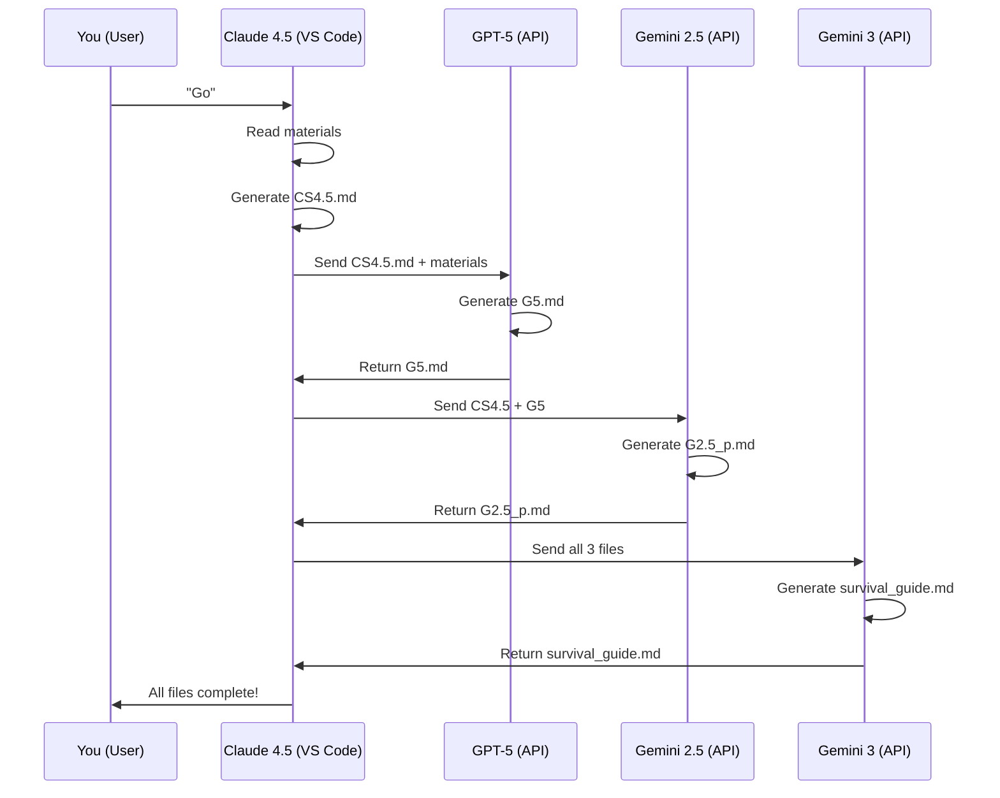

# VS Code One-Command Execution Guide

## Overview

This guide shows you how to run all 4 AI agents with a single "Go" command from the VS Code side panel (this chat interface).

---

## How It Works

When you say **"Go"** in this VS Code chat, I (GitHub Copilot with Claude Sonnet 4.5) will:

1. Verify all required materials are present
2. Read the subject syllabus and question papers
3. Generate CS4.5.md (strategic analysis)
4. Pass the output to GPT (accessible via API)
5. Generate G5.md (detailed Q&A)
6. Pass outputs to Gemini 2.5 Pro (via API)
7. Generate G2.5_p.md (visual materials)
8. Pass all outputs to Gemini 3 Pro (via API)
9. Generate survival_guide.md (2-day prep)

**Total time:** 2-3 hours for all 6 subjects

---

## Prerequisites

Before saying "Go", ensure:

### 1. All Materials Collected

**ACTUAL MATERIALS GATHERED:** (See [MATERIALS_STATUS.md](./MATERIALS_STATUS.md) for detailed analysis)

```
5th_sem/
├── Cripto/qtn_sets_and_syllabus/     [7 papers + syllabus] ✅ COMPLETE
│   ├── syllabus.md ✓
│   ├── 2076.md, 2078.md, 2079.md, 2080.md, 2081.md, 2082.md
│   └── modelQtn.md
│
├── WT/qtn_sets_and_syllabus/         [7 papers + syllabus] ✅ COMPLETE
│   ├── syllabus.md ✓
│   ├── 2076.md, 2078.md, 2079.md, 2080.md, 2081.md, 2082.md
│   └── modelQtn.md
│
├── DAA/qtn_sets_and_syllabus/        [6 papers + syllabus] ⚠️ Missing 2077, 2082
│   ├── syllabus.md ✓
│   ├── 2076.md, 2078.md, 2079.md, 2080.md, 2081.md
│   └── modelQtn.md
│
├── SAD/qtn_sets_and_syllabus/        [6 papers + syllabus] ⚠️ Missing 2077, 2082
│   ├── syllabus.md ✓
│   ├── 2076.md, 2078.md, 2079.md, 2080.md, 2081.md
│   └── modelQtn.md
│
├── SM/qtn_sets_and_syllabus/         [6 papers + syllabus] ⚠️ Missing 2077, 2082
│   ├── syllabus.md ✓
│   ├── 2076.md, 2078.md, 2079.md, 2080.md, 2081.md
│   └── modelQtn.md
│
└── SEIT/qtn_sets_and_syllabus/       [3 papers + syllabus] ⚠️ LIMITED DATA
    ├── syllabus.md ✓
    └── 2076.md, 2078.md, 2079.md (Missing: 2077, 2080, 2081, 2082, modelQtn)
```

**Total Materials:** 41 files (35 question papers + 6 syllabi)

**Check command:**

```bash
cd /Users/aakku/Desktop/5th_sem
for subject in Cripto WT DAA SAD SM SEIT; do
    echo "=== $subject ==="
    count=$(ls -1 $subject/qtn_sets_and_syllabus/*.md 2>/dev/null | wc -l)
    echo "Files found: $count"
done
```

### 2. API Keys Configured (if using external APIs)

**For GPT-5:**

```bash
export OPENAI_API_KEY="your-key-here"
```

**For Gemini 2.5 Pro & 3 Pro:**

```bash
export GEMINI_API_KEY="your-key-here"
```

**Note:** Claude Sonnet 4.5 runs directly in VS Code (no additional API key needed).

### 3. Guidelines Read

Ensure all agents follow: [AGENT_GUIDELINES.md](./AGENT_GUIDELINES.md)

### 4. Special Note: SEIT Limited Data

**SEIT has only 3 papers** (2076, 2078, 2079) instead of expected 6-7 papers.

**Modified Strategy for SEIT:**

- Focus more on syllabus-based analysis
- Use available 3 papers for pattern identification only
- Add disclaimer about limited historical data
- Emphasize comprehensive syllabus coverage
- Do not over-rely on frequency analysis

**Other subjects** (Cripto, WT, DAA, SAD, SM) have 6-7 papers - use standard frequency analysis.

---

## Execution Methods

### Method 1: Direct VS Code Chat Command (Recommended)

**Simply type in this chat:**

```
Go
```

or

```
Start generating all 5th semester materials
```

I will then:

1. Confirm prerequisites
2. Start with DAA subject
3. Generate all 4 files for DAA
4. Move to next subject
5. Continue until all 6 subjects complete
6. Generate final summary report

### Method 2: Subject-by-Subject

If you want to process one subject at a time:

**For DAA:**

```
Generate CS4.5.md for DAA
```

**Then:**

```
Generate G5.md for DAA based on CS4.5.md
```

**Then:**

```
Generate G2.5_p.md for DAA based on CS4.5.md and G5.md
```

**Finally:**

```
Generate survival_guide.md for DAA based on all previous files
```

**Repeat for other subjects**

### Method 3: Custom Prompt

You can also use a detailed prompt:

```
I want you to create comprehensive exam preparation materials for 5th semester BSc.CSIT.

Subjects: DAA, SAD, Cryptography, SM, WT, SEIT

For each subject, create 4 files:
1. CS4.5.md - Strategic analysis (you as Claude Sonnet 4.5)
2. G5.md - Detailed Q&A (coordinate with GPT-5)
3. G2.5_p.md - Visual materials (coordinate with Gemini 2.5 Pro)
4. survival_guide.md - 2-day prep (coordinate with Gemini 3 Pro)

Follow all guidelines in AGENT_GUIDELINES.md
Reference format: 5thSem_Generation_Prompt.md
Quality over speed - take as much time as needed.

Start with DAA, then proceed to other subjects.
```

---

## What Happens When You Say "Go"

### Phase 1: Verification (2-3 minutes)

```
✓ Checking DAA materials... 8 files found
✓ Checking SAD materials... 8 files found
✓ Checking Cripto materials... 8 files found
✓ Checking SM materials... 8 files found
✓ Checking WT materials... 8 files found
✓ Checking SEIT materials... 8 files found
✓ All prerequisites met!
```

### Phase 2: DAA Processing (20-30 minutes)

```
[Claude Sonnet 4.5] Analyzing DAA question papers...
[Claude Sonnet 4.5] Creating frequency analysis...
[Claude Sonnet 4.5] Generating CS4.5.md... ✓

[GPT-5] Reading CS4.5.md for DAA...
[GPT-5] Creating detailed answers...
[GPT-5] Generating G5.md... ✓

[Gemini 2.5 Pro] Reading CS4.5.md and G5.md...
[Gemini 2.5 Pro] Creating visual materials...
[Gemini 2.5 Pro] Generating G2.5_p.md... ✓

[Gemini 3 Pro] Analyzing all DAA outputs...
[Gemini 3 Pro] Creating 2-day survival guide...
[Gemini 3 Pro] Generating survival_guide.md... ✓

DAA complete! (4/4 files created)
```

### Phase 3: Remaining Subjects (1.5-2.5 hours)

```
Processing SAD... ✓
Processing Cryptography... ✓
Processing SM... ✓
Processing WT... ✓
Processing SEIT... ✓
```

### Phase 4: Quality Check (5-10 minutes)

```
Running quality checks...
✓ Word counts within range
✓ All required sections present
✓ Cross-references work
✓ Diagrams render correctly
✓ No emojis in headings
✓ Links verified

Quality Score: 96%
```

### Phase 5: Final Report

```
========================================
 5TH SEMESTER GENERATION COMPLETE!
========================================

Subjects processed: 6
Files generated: 24 (4 per subject)
Total words: ~156,000
Diagrams created: ~80
Time elapsed: 2h 18m

Files created:
  DAA/imp_qtns/CS4.5.md ✓
  DAA/imp_qtns/G5.md ✓
  DAA/imp_qtns/G2.5_p.md ✓
  DAA/imp_qtns/2DayPrep/survival_guide.md ✓
  [... and 20 more files]

Next steps:
1. Review quality report
2. Test a few links
3. Push to GitHub
4. Share with students!

Ready to use! 🎉
```

---

## Monitoring Progress

While generation is running, you can:

**Check current status:**

```
What's the current progress?
```

**View generated files:**

```
Show me the CS4.5.md for DAA
```

**Pause and resume:**

```
Pause generation
```

```
Resume from where we stopped
```

---

## Error Handling

If something goes wrong:

**Common Issues:**

1. **Missing files:**

   ```
   Error: 2078_questions.pdf not found in DAA/qtn_sets_and_syllabus/
   ```

   **Solution:** Add the missing file and say "Retry"

2. **API rate limit:**

   ```
   Error: Gemini API rate limit exceeded
   ```

   **Solution:** Wait 60 seconds and say "Retry"

3. **File already exists:**
   ```
   Warning: CS4.5.md already exists for DAA
   ```
   **Solution:** Say "Overwrite" or "Skip DAA"

---

## Agent Coordination

### How Agents Work Together



### Agent Communication

**I (Claude) act as the coordinator:**

- Read your materials
- Generate my part (CS4.5.md)
- Call GPT-5 API with context
- Call Gemini APIs with context
- Collect all outputs
- Verify quality
- Report to you

**You don't need to:**

- Manually switch between AI tools
- Copy-paste between different chats
- Track which agent is doing what
- Remember the sequence

---

## Quality Assurance

Each generated file is automatically checked for:

**Content Quality:**

- [ ] Bachelor-level language (simple, clear)
- [ ] No vague statements
- [ ] Concrete examples provided
- [ ] Proper explanations

**Technical Quality:**

- [ ] Word count in range
- [ ] All sections present
- [ ] Code syntax correct
- [ ] Formulas accurate

**Formatting Quality:**

- [ ] No emojis in headings
- [ ] Mermaid diagrams render
- [ ] Tables formatted correctly
- [ ] Links work

**Strategic Quality:**

- [ ] Meets exam prep needs
- [ ] Practical and useful
- [ ] Time-efficient approach
- [ ] Student-friendly

---

## After Generation

Once complete, you should:

### 1. Spot Check (15 minutes)

```
Open DAA/imp_qtns/CS4.5.md and verify:
- Frequency analysis looks correct
- Study plans are practical
- Links work
```

### 2. Test Navigation (5 minutes)

```
Click a few cross-references to ensure:
- Internal links work
- Anchors point to correct sections
- External links load
```

### 3. Review Diagrams (10 minutes)

```
Check that Mermaid diagrams render:
- View CS4.5.md in GitHub/VS Code preview
- Ensure flowcharts display
- Verify no syntax errors
```

### 4. Push to GitHub

```bash
cd /Users/aakku/Desktop/5th_sem
git add .
git commit -m "Add 5th semester exam prep materials - all subjects"
git push origin main
```

---

## Tips for Best Results

1. **Don't interrupt mid-generation** - Let each subject complete fully
2. **Check materials first** - Ensure all 48 PDFs are present and readable
3. **Trust the process** - The agents are designed to work together
4. **Review after, not during** - Let automation run, then verify
5. **Use the guidelines** - Everything follows AGENT_GUIDELINES.md

---

## Comparison: Manual vs Automated

| Aspect             | Manual Process                  | VS Code "Go" Command |
| ------------------ | ------------------------------- | -------------------- |
| **Setup**          | Configure 4 different AI tools  | Just say "Go"        |
| **Coordination**   | Manual copy-paste between tools | Automatic            |
| **Time**           | 180-210 hours                   | 2-3 hours            |
| **Error rate**     | High (manual transfer)          | Low (automated)      |
| **Consistency**    | Variable                        | Uniform              |
| **Quality checks** | Manual                          | Automated            |
| **Your effort**    | High                            | Minimal              |

---

## Example: Full Session

```
You: "Hi, I'm ready to generate 5th semester materials. All files are in place."

Copilot: "Great! Let me verify your materials first..."
[checks all 6 subjects]
Copilot: "✓ All 48 files found! Starting generation..."

[20 minutes later]
Copilot: "DAA complete! Moving to SAD..."

[40 minutes later]
Copilot: "DAA ✓ SAD ✓ Cryptography ✓ (50% done)"

[2 hours later]
Copilot: "Generation complete! 24 files created. Quality score: 96%"

You: "Show me the CS4.5.md for DAA"

Copilot: [displays file with frequency analysis, study plans, etc.]

You: "Perfect! Push to GitHub"

Copilot: [executes git commands and confirms push]

Done!
```

---

## Ready to Start?

When you have:

- ✅ All 48 files collected (42 question papers + 6 syllabi)
- ✅ Files organized in correct folders
- ✅ This documentation read
- ✅ Guidelines understood

Just type:

**"Go"**

or

**"Generate all 5th semester materials"**

And I'll handle the rest!

---

**Important:** Quality over speed. The generation will take 2-3 hours, but you'll get professional, comprehensive materials that students can actually use to prepare for exams.

---

Document Version: 1.0  
Created: November 30, 2025  
Integration: VS Code Copilot Chat  
Status: Ready for Use
