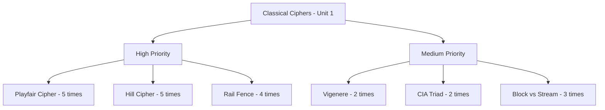
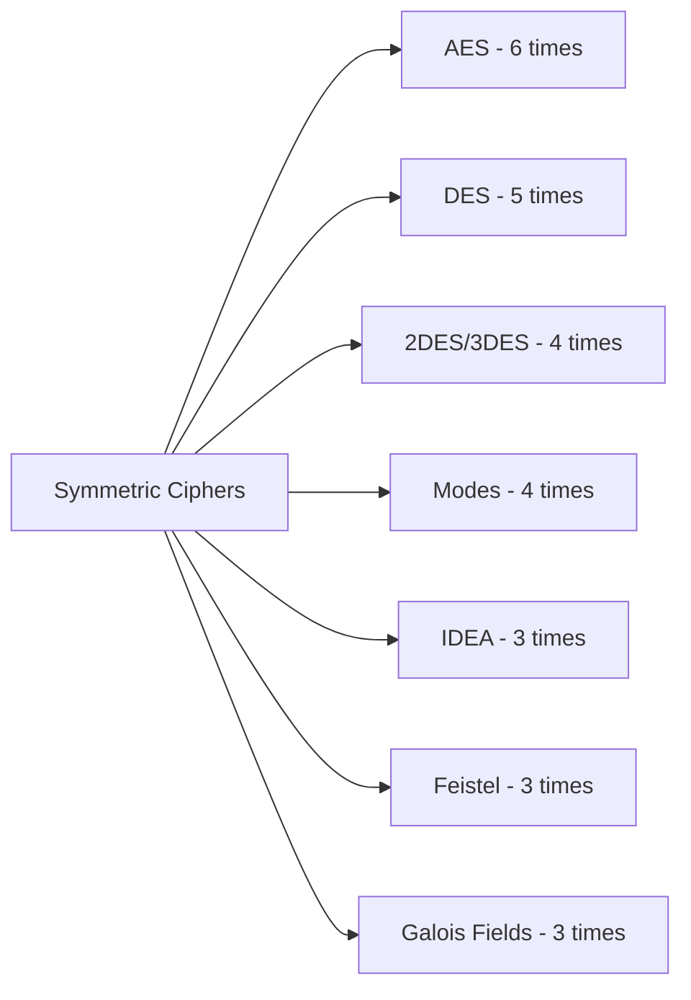
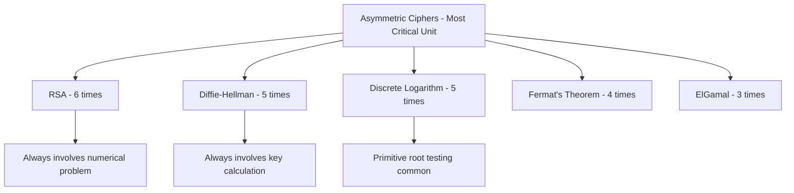
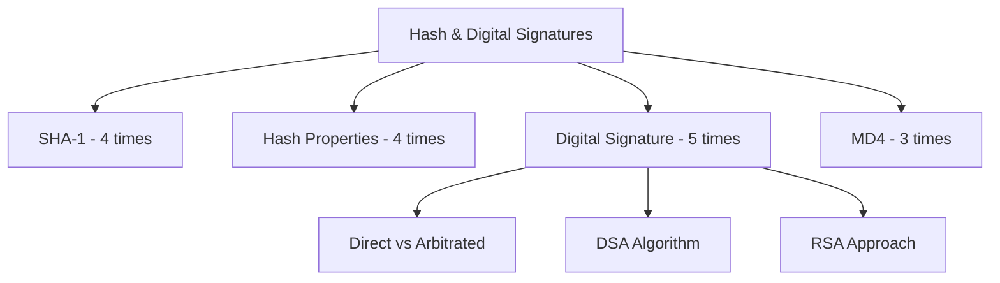
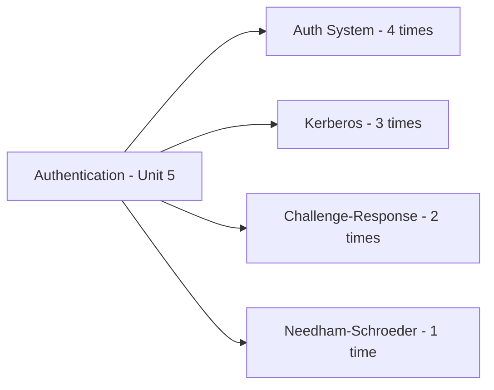
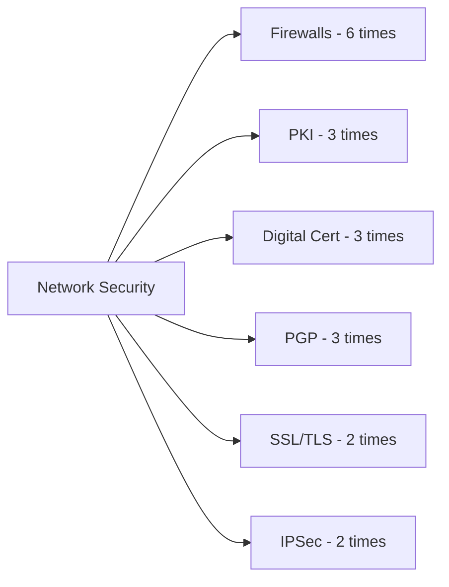
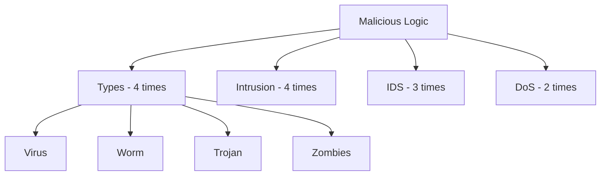

# Cryptography - Strategic Exam Analysis by Claude Sonnet 4.5

## Executive Summary

**Papers Analyzed:** 7 (Years 2076, 2078, 2079, 2080, 2081, 2082, Model Question)
**Total Questions:** 98 questions (14 Section A + 84 Section B)
**High-Priority Topics:** 18 critical topics
**Coverage:** Excellent (All syllabus units well-represented)

**Exam Pattern:**

- Section A: Attempt any 2 questions out of 3 (Long answer type, 10 marks each)
- Section B: Attempt any 8 questions out of 12 (Short answer type, 5 marks each)
- Total Marks: 60 (20 from Section A + 40 from Section B)
- Duration: 3 hours

**Key Insight:** Classical ciphers, RSA algorithm, hash functions, and AES appear in almost every paper. The exam heavily focuses on practical problem-solving rather than just theoretical knowledge.

---

## Frequency Analysis by Unit

### Unit 1: Introduction and Classical Ciphers

**Frequency Score: VERY HIGH** (Appears in 7/7 papers)

**High-Frequency Topics:**

1. **Playfair Cipher** (5 appearances: 2076, 2078, 2079, 2081, 2082)

   - Encryption and decryption problems
   - Keyword-based operations
   - Most tested classical cipher

2. **Hill Cipher** (5 appearances: 2076, 2078, 2080, 2082, Model)

   - Matrix-based encryption and decryption
   - Key matrix operations
   - Always involves practical calculations

3. **Rail Fence Cipher** (4 appearances: 2076, 2079, 2080, 2081)

   - Transposition technique
   - Variable rail numbers (3 or 4 rails)
   - Simple but frequently asked

4. **Vigenere Cipher** (2 appearances: 2078, 2081)

   - Polyalphabetic cipher
   - Key-based encryption

5. **Monoalphabetic vs Polyalphabetic** (2 appearances: 2076, 2079)

   - Vulnerability comparison
   - Security analysis

6. **CIA Triad** (2 appearances: 2078, Model)

   - Confidentiality, Integrity, Availability
   - Fundamental security concepts

7. **Block vs Stream Cipher** (3 appearances: 2078, 2079, Model)

   - Comparison and differentiation
   - Examples of each type

8. **Substitution vs Transposition** (1 appearance: 2080)



**Question Patterns:**

- Encrypt a message using Playfair with given keyword
- Decrypt ciphertext using Hill cipher with key matrix
- Encrypt message using Rail Fence with specified number of rails
- Compare monoalphabetic and polyalphabetic security

**Expected Marks:** 10-15 marks per paper
**Study Priority:** CRITICAL - Must master all cipher algorithms

---

### Unit 2: Symmetric Ciphers

**Frequency Score: VERY HIGH** (Appears in 7/7 papers)

**High-Frequency Topics:**

1. **AES (Advanced Encryption Standard)** (6 appearances: 2076, 2078, 2079, 2080, 2082, Model)

   - Key expansion process
   - Mix column transformation
   - Round operations
   - S-Box usage

2. **DES (Data Encryption Standard)** (5 appearances: 2076, 2078, 2080, Model)

   - Round operation details
   - S-Box functionality
   - F function explanation
   - Weak keys identification

3. **Double DES and Triple DES** (4 appearances: 2078, 2080, Model)

   - Encryption process comparison
   - Security improvements
   - Meet-in-the-middle attack

4. **IDEA Algorithm** (3 appearances: 2076, 2081, 2079)

   - Round operation trace
   - Key set operations
   - 4-bit key examples

5. **Modes of Block Cipher** (4 appearances: 2078, 2081, 2082, Model)

   - ECB, CBC, CFB, OFB, Counter Mode
   - Differences and applications

6. **Feistel Cipher Structure** (3 appearances: 2080, 2082)

   - Generic model explanation
   - Round function details

7. **Galois Fields** (3 appearances: 2078, 2080, Model)

   - GF(p) and GF(2^n)
   - Field properties
   - Polynomial arithmetic over GF
   - Multiplicative inverse
   - Division operations

8. **Euclidean Algorithm** (2 appearances: 2076, 2081)
   - GCD calculation
   - Extended Euclidean Algorithm



**Question Patterns:**

- Explain mix column transformation in AES with example
- Describe S-Box task in DES with example
- Compare double and triple DES encryption process
- Trace first round operation of IDEA with given key set
- Explain different modes of block cipher encryption
- Divide polynomials over GF(7) or GF(9)

**Expected Marks:** 15-20 marks per paper
**Study Priority:** CRITICAL - Heaviest unit in terms of marks

---

### Unit 3: Asymmetric Ciphers

**Frequency Score: VERY HIGH** (Appears in 7/7 papers)

**High-Frequency Topics:**

1. **RSA Algorithm** (6 appearances: 2078, 2079, 2080, Model)

   - Key generation process
   - Encryption and decryption steps
   - Practical numerical problems
   - Digital signature using RSA

2. **Diffie-Hellman Key Exchange** (5 appearances: 2076, 2079, 2080, 2081, 2082)

   - Secret key sharing procedure
   - Private and public key calculation
   - Man-in-the-middle attack
   - Primitive root selection

3. **ElGamal Cryptosystem** (3 appearances: 2076, 2079, 2082)

   - Encryption process with given parameters
   - Public key cryptography application

4. **Discrete Logarithm** (5 appearances: 2076, 2080, 2081, 2082)

   - Definition and importance
   - Primitive root testing
   - Applications over normal logarithm

5. **Fermat's Theorem** (4 appearances: 2076, 2078, 2080, 2082)

   - Statement with examples
   - Application in modular arithmetic
   - Power calculation using theorem

6. **Euler's Theorem and Totient Function** (3 appearances: 2076, 2078, 2081)

   - Definition with examples
   - Role of prime numbers
   - Totient value calculation

7. **Miller-Rabin Primality Test** (2 appearances: 2079, 2080)

   - Algorithm explanation
   - Testing specific numbers

8. **Prime Numbers and Number Theory** (3 appearances: various)
   - Relatively prime condition
   - Quadratic residues



**Question Patterns:**

- Given p and q, find public key, private key, encrypt and decrypt message using RSA
- Calculate private keys and shared secret in Diffie-Hellman with given parameters
- Encrypt message using ElGamal with given prime, primitive root, and private key
- State Fermat's theorem with example and solve modular arithmetic problem
- Find whether a number is primitive root of another
- Test primality using Miller-Rabin algorithm

**Expected Marks:** 15-20 marks per paper
**Study Priority:** CRITICAL - Most calculation-intensive unit

---

### Unit 4: Cryptographic Hash Functions and Digital Signatures

**Frequency Score: VERY HIGH** (Appears in 7/7 papers)

**High-Frequency Topics:**

1. **SHA-1 Algorithm** (4 appearances: 2078, 2079, 2080, 2082)

   - Hash value generation process
   - Algorithm steps and details
   - Most frequently asked hash function

2. **Properties of Hash Functions** (4 appearances: 2079, 2080, 2081, 2082)

   - Essential properties listing
   - Applications of hash functions
   - Security characteristics

3. **MD4 Algorithm** (3 appearances: 2078, 2081, Model)

   - First pass operations
   - Digest computation in different passes
   - Message digest generation

4. **SHA-1 vs SHA-2** (1 appearance: 2076)

   - Parameter comparison
   - Family differences

5. **Digital Signature** (5 appearances: 2076, 2079, 2082, Model)

   - Generic model and process
   - Direct vs Arbitrated signatures
   - DSS approaches

6. **Digital Signature Algorithm (DSA)** (2 appearances: 2079, 2082)

   - DSS approach explanation
   - Working mechanism

7. **RSA Digital Signature** (2 appearances: 2079, Model)

   - Generation and verification process
   - RSA approach in DSS

8. **Message Authentication Code (MAC)** (2 appearances: 2076, 2081)
   - Definition and purpose
   - Limitations of MAC
   - Message authentication functions



**Question Patterns:**

- Describe how SHA-1 generates hash value from message
- List properties of hash functions and their applications
- Discuss MD4 first pass or digest computation process
- Compare SHA-1 and SHA-2 parameters
- Explain digital signature generation and verification using RSA
- Differentiate direct and arbitrated digital signatures
- Describe DSS approach and DSA working

**Expected Marks:** 10-15 marks per paper
**Study Priority:** HIGH - Theoretical understanding crucial

---

### Unit 5: Authentication

**Frequency Score: HIGH** (Appears in 6/7 papers)

**High-Frequency Topics:**

1. **Authentication System** (4 appearances: 2078, 2080, 2082, Model)

   - Formal definition
   - One-way vs mutual authentication
   - Need for mutual authentication with examples

2. **Kerberos Protocol** (3 appearances: 2079, 2081, Model)

   - Working mechanism
   - Need and purpose
   - Protocol details

3. **Needham-Schroeder Protocol** (1 appearance: 2081)

   - Scheme description

4. **Challenge-Response System** (2 appearances: 2079, 2082)

   - Concept and definition
   - Implementation details

5. **Password-Based Authentication** (Limited direct questions)
   - Dictionary attacks
   - Biometric systems



**Question Patterns:**

- Define authentication system formally
- Illustrate need for mutual authentication with example
- Describe Kerberos protocol working mechanism
- Explain challenge-response system concept
- Describe Needham-Schroeder scheme

**Expected Marks:** 5-10 marks per paper
**Study Priority:** MEDIUM - Moderate frequency

---

### Unit 6: Network Security and Public Key Infrastructure

**Frequency Score: VERY HIGH** (Appears in 7/7 papers)

**High-Frequency Topics:**

1. **PKI Trust Models** (3 appearances: 2078, 2081, Model)

   - Trust model description
   - Architecture explanation

2. **Digital Certificates and X.509** (3 appearances: 2076, 2078, 2082)

   - Certificate elements listing
   - X.509 structure
   - Certificate life cycle management

3. **PGP (Pretty Good Privacy)** (3 appearances: 2078, 2079, 2080)

   - Services provided
   - Email security features
   - Five core services

4. **SSL/TLS Protocol** (2 appearances: 2078, Model)

   - Protocol description
   - Security mechanisms

5. **IPSec** (2 appearances: 2080, Model)

   - Components explanation
   - IP security features

6. **Firewalls** (6 appearances: 2076, 2078, 2080, 2081, 2082, Model)
   - Task and purpose
   - Types of firewalls
   - Circuit level gateway
   - Stateful inspection
   - One of the most tested topics



**Question Patterns:**

- List types of firewalls and explain
- Describe PKI trust model
- List elements of X.509 certificate
- Mention services provided by PGP
- Explain SSL protocol
- Describe IPSec and its components
- Discuss certificate life cycle stages

**Expected Marks:** 10-15 marks per paper
**Study Priority:** HIGH - Firewalls are critical

---

### Unit 7: Malicious Logic

**Frequency Score: HIGH** (Appears in 6/7 papers)

**High-Frequency Topics:**

1. **Types of Malicious Logic** (4 appearances: 2079, 2080, 2081, 2082)

   - Virus
   - Worm
   - Trojan Horse
   - Zombies
   - Comparison between types

2. **Virus vs Worms** (2 appearances: 2076, 2081)

   - Nature differences
   - Behavior comparison

3. **Trojan Horse vs Zombies** (2 appearances: 2079, 2080)

   - Distinction and characteristics

4. **DoS (Denial of Service) Attacks** (2 appearances: 2076, 2081, Model)

   - Concept explanation
   - Examples and types

5. **Intrusion and Intruders** (4 appearances: 2078, 2079, 2080, 2081)

   - Definition of intrusion
   - Types of intruders
   - Classes of intruders

6. **Intrusion Detection System (IDS)** (3 appearances: 2078, 2080, 2081)
   - Detection mechanisms
   - Types of IDS
   - Working principle



**Question Patterns:**

- Describe any three types of malicious logic
- How does nature of worms differ from viruses
- Differentiate between Trojan horse and virus
- How are zombies different from Trojan horses
- What is intrusion? How does system detect it?
- Explain any two types of intruders
- What is DoS attack? Provide examples

**Expected Marks:** 5-10 marks per paper
**Study Priority:** MEDIUM - Short answer questions

---

## Strategic Study Recommendations

### Critical Topics (Must Master - 5+ Appearances)

These topics appear in almost every paper and are non-negotiable for exam success:

1. **RSA Algorithm** (6 times)

   - Complete understanding of key generation
   - Practice numerical problems with different p, q values
   - Master encryption, decryption, and digital signature variants
   - Expected: At least one 10-mark question

2. **AES (Advanced Encryption Standard)** (6 times)

   - Key expansion process step-by-step
   - Mix column transformation with examples
   - S-Box operations
   - Round function details
   - Expected: 5-10 marks

3. **Firewalls** (6 times)

   - All types memorized with explanations
   - Task and purpose clear
   - Circuit level vs stateful inspection differences
   - Expected: 5 marks

4. **Playfair Cipher** (5 times)

   - Algorithm memorized perfectly
   - Practice with different keywords
   - Both encryption and decryption
   - Expected: 5 marks

5. **Hill Cipher** (5 times)

   - Matrix operations mastered
   - Encryption and decryption with key matrices
   - Matrix inverse calculations
   - Expected: 5 marks

6. **DES** (5 times)

   - Round operation detailed understanding
   - S-Box functionality with examples
   - F function explanation
   - Weak keys identification
   - Expected: 5-10 marks

7. **Diffie-Hellman** (5 times)

   - Secret key sharing procedure
   - Private and public key calculations
   - Man-in-the-middle attack explanation
   - Primitive root usage
   - Expected: 5-10 marks

8. **Discrete Logarithm** (5 times)

   - Definition clear
   - Primitive root testing algorithm
   - Importance over normal logarithm
   - Expected: 5 marks

9. **Digital Signature** (5 times)
   - Generic model and process
   - Direct vs Arbitrated differences
   - DSS approaches
   - RSA approach
   - Expected: 5-10 marks

---

### High-Priority Topics (3-4 Appearances)

These topics appear frequently and should be prepared thoroughly:

1. **SHA-1 Algorithm** (4 times)
   - Hash generation process step-by-step
   - All rounds and operations
2. **Properties of Hash Functions** (4 times)

   - All properties listed and explained
   - Applications memorized

3. **Rail Fence Cipher** (4 times)

   - Algorithm for different rail numbers
   - Practice with 3 and 4 rails

4. **Modes of Block Cipher** (4 times)

   - All five modes explained
   - ECB, CBC, CFB, OFB, Counter Mode differences

5. **Double/Triple DES** (4 times)

   - Encryption process comparison
   - Security improvements
   - Meet-in-the-middle attack

6. **Fermat's Theorem** (4 times)

   - Statement memorized
   - Application in modular arithmetic
   - Practice power calculations

7. **Authentication System** (4 times)

   - Formal definition
   - One-way vs mutual authentication

8. **Types of Malicious Logic** (4 times)

   - All types defined clearly
   - Comparisons prepared

9. **Intrusion/Intruders** (4 times)

   - Definitions clear
   - Types and classes memorized

10. **ElGamal Cryptosystem** (3 times)

    - Encryption process with parameters

11. **IDEA Algorithm** (3 times)

    - Round operation understanding

12. **Feistel Cipher** (3 times)

    - Structure explanation

13. **Galois Fields** (3 times)

    - GF(p) and GF(2^n) operations
    - Polynomial arithmetic

14. **Kerberos** (3 times)

    - Working mechanism

15. **PKI Trust Models** (3 times)

    - Architecture and trust models

16. **Digital Certificates** (3 times)

    - X.509 elements and life cycle

17. **PGP Services** (3 times)

    - All five services

18. **MD4 Algorithm** (3 times)

    - Pass operations and digest computation

19. **IDS** (3 times)
    - Types and detection mechanisms

---

### Medium-Priority Topics (2 Appearances)

Study these after completing critical and high-priority topics:

1. Euler's Theorem and Totient Function (3 times)
2. Miller-Rabin Primality Test (2 times)
3. Vigenere Cipher (2 times)
4. Euclidean Algorithm (2 times)
5. CIA Triad (2 times)
6. MAC (Message Authentication Code) (2 times)
7. DSA (Digital Signature Algorithm) (2 times)
8. RSA Digital Signature (2 times)
9. Challenge-Response System (2 times)
10. SSL/TLS Protocol (2 times)
11. IPSec (2 times)
12. Virus vs Worms comparison (2 times)
13. DoS Attacks (2 times)

---

### Low-Priority Topics (1 Appearance)

Review if time permits:

1. SHA-1 vs SHA-2 comparison
2. Monoalphabetic vs Polyalphabetic comparison
3. Substitution vs Transposition ciphers
4. Needham-Schroeder Protocol
5. Quadratic residues
6. Relatively prime condition
7. Policy and Mechanism in cryptography
8. Password-based authentication and dictionary attacks
9. Biometric systems

---

## Study Plans

### 30-Day Complete Preparation Plan

**Days 1-7: Classical and Symmetric Ciphers (Units 1 & 2)**

Day 1-2: Classical Ciphers

- Study Caesar, Monoalphabetic basics
- Master Playfair cipher (practice 5 problems)
- Master Hill cipher (practice 5 problems with matrices)
- Learn Rail Fence cipher (practice 3 problems)
- Understand Vigenere cipher

Day 3-5: Symmetric Ciphers - Part 1

- Study Feistel cipher structure
- Master DES: round operation, S-Box, F function
- Understand weak keys concept
- Learn Double DES and Triple DES
- Understand meet-in-the-middle attack

Day 6-7: Symmetric Ciphers - Part 2

- Master AES: key expansion, mix column, S-Box
- Learn IDEA: round operations
- Master all 5 modes of block cipher (ECB, CBC, CFB, OFB, Counter)
- Study Galois Fields: GF(p), GF(2^n)
- Practice polynomial arithmetic (division over GF)

**Days 8-14: Asymmetric Ciphers (Unit 3)**

Day 8-9: Number Theory Foundations

- Study prime numbers and primality testing
- Master Fermat's theorem with examples
- Learn Euler's theorem and totient function
- Practice modular arithmetic calculations
- Study discrete logarithm concept

Day 10-11: RSA Algorithm

- Master key generation process
- Practice encryption and decryption (solve 10 problems)
- Understand different p, q combinations
- Learn RSA for digital signatures
- Practice numerical problems

Day 12-13: Diffie-Hellman and ElGamal

- Master Diffie-Hellman key exchange
- Learn private/public key calculation
- Understand man-in-the-middle attack
- Study primitive root testing
- Master ElGamal encryption with parameters

Day 14: Number Theory Advanced

- Miller-Rabin primality test algorithm
- Extended Euclidean algorithm
- Multiplicative inverse calculations
- Relatively prime concepts
- Quadratic residues

**Days 15-21: Hash Functions and Digital Signatures (Unit 4)**

Day 15-16: Hash Functions

- Study all properties of hash functions
- Master SHA-1 algorithm step-by-step
- Learn MD4 algorithm and passes
- Understand SHA-2 family
- Study applications of hash functions

Day 17-18: Message Authentication

- Learn Message Authentication Codes (MAC)
- Understand MAC limitations
- Study message authentication functions
- Practice MAC-based problems

Day 19-21: Digital Signatures

- Master generic digital signature model
- Understand direct vs arbitrated signatures
- Learn Digital Signature Algorithm (DSA)
- Study DSS approach thoroughly
- Master RSA approach for digital signatures
- Practice signature generation and verification

**Days 22-26: Authentication and Network Security (Units 5 & 6)**

Day 22-23: Authentication Systems

- Study authentication system definition
- Master one-way vs mutual authentication
- Learn challenge-response system
- Study Kerberos protocol completely
- Understand Needham-Schroeder scheme
- Study password-based authentication
- Learn about biometric systems

Day 24-26: Network Security and PKI

- Master all firewall types (critical topic)
- Study PKI trust models thoroughly
- Learn digital certificates and X.509 structure
- Master certificate life cycle management
- Study PGP: all 5 services memorized
- Learn SSL/TLS protocol
- Understand IPSec components
- Study PKIX

**Days 27-28: Malicious Logic (Unit 7)**

- Study all types of malicious logic: virus, worm, Trojan, zombies
- Master differences: virus vs worms, Trojan vs zombies
- Learn DoS attacks with examples
- Study intrusion definition
- Master all intruder types and classes
- Understand IDS types and mechanisms
- Practice comparison questions

**Days 29-30: Revision and Practice**

Day 29: Numerical Problem Marathon

- Solve 5 RSA problems
- Solve 5 Diffie-Hellman problems
- Solve 5 Playfair problems
- Solve 5 Hill cipher problems
- Solve 3 ElGamal problems
- Solve 5 Rail Fence problems
- Practice Galois field divisions

Day 30: Theory and Short Answer Sprint

- Review all definitions
- Memorize all lists (firewall types, PGP services, hash properties)
- Practice comparison questions
- Review all algorithms (SHA-1, MD4, DSA)
- Go through all previous year questions once

---

### 15-Day Crash Course

**Days 1-3: Classical Ciphers + Critical Symmetric (Units 1 & 2 - Critical)**

Day 1:

- Playfair cipher (practice 3 problems)
- Hill cipher (practice 3 problems)
- Rail Fence cipher (practice 2 problems)

Day 2:

- DES: round operation, S-Box, F function
- AES: key expansion, mix column transformation
- Modes of block cipher (all 5)

Day 3:

- IDEA round operation
- Double/Triple DES
- Galois fields and polynomial division (practice 3 problems)

**Days 4-7: Asymmetric Ciphers - Complete (Unit 3 - Highest Priority)**

Day 4:

- Fermat's theorem with examples
- Euler's theorem and totient function
- Discrete logarithm and primitive root testing

Day 5-6:

- RSA algorithm complete (practice 5 problems)
- Key generation, encryption, decryption
- Digital signature using RSA

Day 7:

- Diffie-Hellman (practice 3 problems)
- ElGamal cryptosystem (practice 2 problems)
- Miller-Rabin test

**Days 8-10: Hash and Digital Signatures (Unit 4)**

Day 8:

- Properties of hash functions
- SHA-1 algorithm complete
- MD4 algorithm

Day 9:

- Digital signature generic model
- Direct vs arbitrated signatures
- DSA algorithm

Day 10:

- MAC and limitations
- DSS approaches
- RSA approach for signatures

**Days 11-13: Authentication and Network Security (Units 5 & 6)**

Day 11:

- Authentication system (one-way vs mutual)
- Kerberos protocol
- Challenge-response system

Day 12:

- All firewall types (critical - memorize completely)
- PKI trust models
- Digital certificates and X.509

Day 13:

- PGP services (all 5)
- SSL/TLS protocol
- IPSec components

**Days 14: Malicious Logic (Unit 7)**

- All malicious logic types
- Virus vs worms vs Trojan vs zombies
- Intrusion and intruder types
- IDS types
- DoS attacks

**Day 15: Intensive Revision**

Morning: Numerical problems (RSA, Diffie-Hellman, ciphers)
Afternoon: Theory topics and algorithms
Evening: Previous year questions

---

### 7-Day Intensive Strategy

**Day 1: Critical Ciphers Only**

Morning:

- Playfair cipher (2 problems)
- Hill cipher (2 problems)
- Rail Fence cipher (1 problem)

Afternoon:

- AES key expansion and mix column
- DES S-Box and F function

Evening:

- Modes of block cipher (all 5)
- Galois field division (1 problem)

**Day 2: RSA Marathon**

Full day dedicated to RSA:

- Theory: key generation steps
- Practice: 10 RSA problems
- Digital signature using RSA
- Different scenarios with various p, q values

**Day 3: Diffie-Hellman + Discrete Logarithm**

Morning:

- Diffie-Hellman theory
- Practice 5 problems
- Man-in-the-middle attack

Afternoon:

- Discrete logarithm concept
- Primitive root testing
- ElGamal (2 problems)

Evening:

- Fermat's theorem (practice 3 calculations)
- Euler's theorem

**Day 4: Hash Functions and Digital Signatures**

Morning:

- SHA-1 algorithm completely
- Properties of hash functions
- MD4 passes

Afternoon:

- Digital signature model
- Direct vs arbitrated
- DSA algorithm

Evening:

- DSS approaches
- MAC and limitations

**Day 5: Network Security Critical Topics**

Morning:

- All firewall types (memorize)
- PKI trust models
- Digital certificates

Afternoon:

- PGP 5 services
- SSL/TLS
- IPSec

Evening:

- Authentication system
- Kerberos protocol
- Challenge-response

**Day 6: Malicious Logic + Remaining Topics**

Morning:

- All malicious logic types
- Comparisons (virus vs worm, etc.)

Afternoon:

- Intrusion and IDS
- DoS attacks
- IDEA round operation

Evening:

- Double/Triple DES
- Feistel structure

**Day 7: Revision and Mock Test**

Morning: Solve one complete previous year paper under timed conditions
Afternoon: Review mistakes and weak areas
Evening: Quick revision of all formulas, lists, and critical algorithms

---

### 2-Day Survival Strategy

**Day 1: Maximum Coverage Strategy (12-14 hours)**

**Hour 1-2: Top 3 Classical Ciphers**

- Playfair: Algorithm only, 1 practice problem
- Hill cipher: Algorithm only, 1 practice problem
- Rail Fence: Algorithm only, 1 practice problem

**Hour 3-5: RSA Complete (CRITICAL)**

- Key generation formula
- Encryption/decryption formula
- Practice 3 problems rapidly
- Digital signature variant

**Hour 6-7: AES and DES Essentials**

- AES: Mix column transformation (understand one example)
- DES: S-Box function (one example)
- Modes: Memorize names and one-line definitions

**Hour 8-9: Diffie-Hellman (CRITICAL)**

- Formula for private/public key
- Practice 2 problems
- Man-in-the-middle attack (brief understanding)

**Hour 10-11: Hash and Signatures**

- SHA-1: Main steps only (not detailed)
- Properties of hash: List of 5 properties
- Digital signature: Direct vs arbitrated (definitions only)
- DSA: Main concept only

**Hour 12-13: Network Security Lists**

- Firewall types: All types with one-line definitions
- PGP services: All 5 services
- PKI trust model: Basic concept
- X.509: Elements list

**Hour 14: Malicious Logic Quick Review**

- Virus, worm, Trojan, zombies: Definitions only
- Intrusion: Definition and 2 types
- DoS: Definition and 1 example

---

**Day 2: Consolidation and Practice (10-12 hours)**

**Hour 1-3: Numerical Problem Speed Practice**

- 3 RSA problems
- 2 Diffie-Hellman problems
- 1 Playfair problem
- 1 Hill cipher problem
- 1 Rail Fence problem

**Hour 4-5: Theory Short Answers Memorization**

- Authentication system definition
- Kerberos concept
- All firewall types review
- All hash properties review
- All PGP services review

**Hour 6-7: Remaining Critical Topics**

- Discrete logarithm: Definition and importance
- Fermat's theorem: Statement and 1 example
- ElGamal: Basic formula
- Galois fields: One division problem

**Hour 8-9: Algorithm Quick Reviews**

- SHA-1: Major steps
- DSA: Working mechanism
- IDEA: Round concept
- Double/Triple DES: Basic difference

**Hour 10-11: Final Previous Year Paper**

- Solve 2080 or 2081 paper under 3-hour time limit
- Focus on attempting all 10 questions (2 from A, 8 from B)

**Hour 12: Last Minute Revision**

- All formulas list
- All definition lists
- All comparison topics
- Quick glance at weak areas

**Critical Lists to Memorize in 2 Days:**

1. Firewall types (6-7 types with one-liners)
2. PGP services (5 services)
3. Hash function properties (5 properties)
4. Malicious logic types (4 types with definitions)
5. Modes of block cipher (5 modes)
6. Intruder types (3-4 types)
7. Digital signature types (2 types)

---

## Question Selection Strategy

### Section A Strategy (Attempt any 2 out of 3, 10 marks each)

**Pattern Analysis:**

- Question 1: Usually combines 2-3 topics from different units
- Question 2: Often focuses on asymmetric ciphers (RSA or ElGamal) with numerical problem
- Question 3: Typically includes hash functions or advanced topics with some calculations

**Recommended Selection Criteria:**

**Priority 1: Choose questions with these topics (easiest to score full marks)**

- RSA numerical problem (very predictable)
- SHA-1 or hash algorithm explanation
- AES round operations or key expansion
- DES operations with examples
- Classical cipher with practical problem

**Priority 2: Avoid if possible**

- Questions requiring multiple complex calculations
- Questions with unfamiliar combinations
- Questions asking for three different unrelated topics

**Sample Selection Strategy from Past Papers:**

2076 Paper:

- Choose Q1: Monoalphabetic/polyalphabetic + DES weak keys + IDEA (manageable)
- Choose Q3: SHA comparison + Hill cipher problem (good combination)
- Avoid Q2: Fermat + ElGamal (both require careful calculation)

2078 Paper:

- Choose Q1: CIA triad + Double/Triple DES + DES S-Box (all theory-heavy)
- Choose Q2: Digital signature + RSA problem (excellent if RSA is strong)
- Avoid Q3: Galois field + modes + quadratic residues (too diverse)

2079 Paper:

- Choose Q1: Security policy + AES key expansion (both scoring topics)
- Choose Q3: Field proof + ElGamal problem (good if number theory strong)
- Avoid Q2: Hash properties + SHA-1 (only if weak in algorithms)

**Time Management for Section A:**

- Allocate 30 minutes per question
- Total: 60 minutes for Section A
- Leave 120 minutes for Section B

---

### Section B Strategy (Attempt any 8 out of 12, 5 marks each)

**Categorize Questions by Difficulty:**

**Easy Questions (3-5 minutes each, aim for 4-5 of these):**

- List-based questions (firewall types, PGP services, hash properties)
- Definition questions (intrusion, authentication, discrete logarithm)
- Simple comparisons (virus vs worm, block vs stream)
- Short algorithm explanations (Kerberos, challenge-response)

**Medium Questions (6-8 minutes each, aim for 3-4 of these):**

- Classical cipher problems (Playfair, Hill cipher, Rail Fence)
- Short numerical problems (GCD using Euclidean, simple RSA)
- Algorithm explanations (PKI trust model, DSA working)
- Certificate life cycle, SSL protocol

**Avoid/Last Priority:**

- Very calculation-intensive problems if running short on time
- Topics you are completely unfamiliar with
- Questions with multiple sub-parts if time is limited

**Recommended Selection Pattern:**

**Must Select (if available):**

1. Firewall types question (always present, easy 5 marks)
2. One classical cipher practical problem (Playfair or Hill or Rail Fence)
3. Any list-based question (PGP, hash properties, X.509 elements)
4. Authentication system definition or Kerberos
5. Malicious logic comparison (virus vs worm, etc.)

**Should Select (if comfortable):** 6. Fermat's theorem with example 7. Discrete logarithm or primitive root 8. PKI trust model or digital certificate

**Conditional Selection:** 9. GCD or Euclidean algorithm (if comfortable with calculations) 10. Galois field division (if practiced enough) 11. Short numerical RSA or Diffie-Hellman 12. IDS types or intrusion-related questions

**Time Management for Section B:**

- Allocate 15 minutes per question
- Total: 120 minutes for 8 questions
- Answer easy questions first to build confidence
- Leave difficult calculations for last

---

## Common Mistakes to Avoid

### Calculation Errors

1. **RSA Algorithm:**

   - Mistake: Calculating φ(n) incorrectly as p × q instead of (p-1) × (q-1)
   - Mistake: Forgetting to apply mod n during encryption/decryption
   - Mistake: Not verifying that e and φ(n) are coprime
   - Solution: Always write φ(n) = (p-1)(q-1) explicitly first

2. **Diffie-Hellman:**

   - Mistake: Confusing private and public keys
   - Mistake: Not applying mod p consistently
   - Mistake: Using wrong formula for shared key calculation
   - Solution: Label clearly: private keys (small letters), public keys (capital letters)

3. **Hill Cipher:**

   - Mistake: Matrix multiplication order confusion
   - Mistake: Forgetting to apply mod 26
   - Mistake: Incorrect matrix inverse calculation
   - Solution: For encryption: Ciphertext = Key × Plaintext (mod 26)

4. **Galois Field Operations:**
   - Mistake: Not applying modulo at each step
   - Mistake: Polynomial coefficient errors
   - Solution: Show every step of polynomial long division clearly

### Conceptual Errors

1. **Block vs Stream Ciphers:**

   - Mistake: Confusing examples (calling DES a stream cipher)
   - Correct: DES, AES, IDEA are block ciphers; RC4, Vernam are stream ciphers

2. **Symmetric vs Asymmetric:**

   - Mistake: Confusing key types
   - Correct: Symmetric = same key; Asymmetric = public/private key pair

3. **Digital Signature:**

   - Mistake: Encrypting with public key for signature
   - Correct: Sign with private key, verify with public key

4. **Hash Properties:**
   - Mistake: Forgetting one-way property or collision resistance
   - Solution: Memorize all three: one-way, weak collision resistance, strong collision resistance

### Writing Errors

1. **Algorithm Explanations:**

   - Mistake: Writing vague steps like "perform operations"
   - Solution: Be specific with each step, mention input/output clearly

2. **Diagrams:**

   - Mistake: Not labeling diagrams properly
   - Solution: Always label all boxes, arrows, and components

3. **Comparisons:**
   - Mistake: Only explaining one side of comparison
   - Solution: Use table format for comparisons

### Time Management Errors

1. **Spending Too Long on One Question:**

   - Solution: If stuck for more than 10 minutes on Section B question, move on

2. **Not Attempting Enough Questions:**

   - Solution: Attempt 10 questions minimum (2+8), even if some are incomplete

3. **Starting with Difficult Questions:**
   - Solution: Always start with easiest questions to build momentum

### Memorization Errors

1. **Lists:**

   - Mistake: Writing 4 firewall types when you know 6
   - Solution: Memorize exact numbers: 6-7 firewall types, 5 PGP services, 5 modes

2. **Formulas:**
   - Mistake: Writing wrong formula for RSA decryption
   - Solution: Write formula first, then substitute values

---

## Mark Distribution Analysis

### Expected Mark Distribution per Unit

**Unit 1: Classical Ciphers (10-15 marks)**

- Section A: 0-5 marks (part of combined question)
- Section B: 10-15 marks (2-3 questions)
- Typical questions: Playfair, Hill cipher, Rail Fence

**Unit 2: Symmetric Ciphers (15-20 marks - Highest)**

- Section A: 5-10 marks (AES, DES detailed questions)
- Section B: 10-15 marks (2-3 questions on IDEA, modes, Galois fields)
- Typical questions: AES mix column, DES operations, modes comparison

**Unit 3: Asymmetric Ciphers (15-20 marks - Highest)**

- Section A: 10 marks (Usually one complete RSA or ElGamal problem)
- Section B: 10-15 marks (2-3 questions on Fermat, Diffie-Hellman, discrete log)
- Typical questions: RSA calculation, Diffie-Hellman key exchange

**Unit 4: Hash and Digital Signatures (10-15 marks)**

- Section A: 5-10 marks (SHA-1 algorithm or digital signature process)
- Section B: 5-10 marks (1-2 questions on properties, MAC, DSA)
- Typical questions: SHA-1 steps, hash properties, digital signature types

**Unit 5: Authentication (5-10 marks)**

- Section A: 0-5 marks (rarely main topic)
- Section B: 5-10 marks (1-2 questions)
- Typical questions: Authentication system, Kerberos, challenge-response

**Unit 6: Network Security (10-15 marks)**

- Section A: 0-5 marks (part of combined question)
- Section B: 10-15 marks (2-3 questions, firewall always present)
- Typical questions: Firewall types, PGP services, PKI, digital certificates

**Unit 7: Malicious Logic (5-10 marks)**

- Section A: 0 marks (never in Section A)
- Section B: 5-10 marks (1-2 questions)
- Typical questions: Malicious logic types, intrusion, IDS

### Scoring Strategy

**To Score 40+ marks (67%):**

- Must master: RSA, Diffie-Hellman, classical ciphers, firewalls
- Must attempt: All easy list-based questions
- Can skip: Some advanced theory questions

**To Score 48+ marks (80%):**

- Must master: All critical topics (RSA, AES, DES, Diffie-Hellman, SHA-1)
- Must master: All classical ciphers
- Must master: Hash functions and digital signatures
- Can have weaknesses: Some Unit 5 and Unit 7 topics

**To Score 54+ marks (90%):**

- Must master: All units thoroughly
- Must solve: All numerical problems accurately
- Must explain: All algorithms clearly
- Can have minor weaknesses: Very specific topics like Needham-Schroeder

---

## Final Exam Day Tips

### Pre-Exam Preparation (Morning of Exam)

**Do Not Study New Topics:**

- Only revise what you already know
- Focus on formulas and lists

**Quick Revision Checklist (30 minutes):**

1. RSA formula: C = M^e mod n, M = C^d mod n, φ(n) = (p-1)(q-1)
2. Diffie-Hellman: Public = g^private mod p, Shared = Public^private mod p
3. Playfair algorithm steps
4. Hill cipher: C = K × P (mod 26)
5. All firewall types list
6. PGP 5 services list
7. Hash 5 properties list
8. Modes of block cipher names

**Materials to Carry:**

- Calculator (if allowed)
- Extra pens
- Ruler for drawing tables and diagrams
- Watch for time management

### During the Exam

**First 10 Minutes - Question Paper Analysis:**

1. Read all Section A questions (mark difficulty)
2. Read all Section B questions (mark difficulty)
3. Identify your 2 Section A questions
4. Identify your 8 Section B questions
5. Plan your sequence

**Question Sequence Strategy:**

**Phase 1 (First 60 minutes): Section B Easy Questions (4 questions)**

- Start with easiest 4 Section B questions
- List-based questions first
- Build confidence and momentum
- Aim: 20 marks secured in first hour

**Phase 2 (Next 60 minutes): Section A (2 questions)**

- Attempt both Section A questions
- Show all calculation steps clearly
- Don't skip any part
- Aim: 20 marks total from Section A

**Phase 3 (Next 60 minutes): Section B Remaining (4 questions)**

- Attempt remaining 4 Section B questions
- Include any calculation-intensive problems
- Aim: 20 marks from these questions

**Final 10 Minutes: Review**

- Check all calculations
- Ensure all questions attempted
- Verify question numbers written correctly

### Answer Writing Tips

**For Numerical Problems:**

1. Write given information first
2. Write formula/approach
3. Show all steps clearly
4. Box/underline final answer
5. Mention units if applicable

Example format:

```
Given: p = 13, q = 7
Find: Public key, private key, encrypt M = 8

Solution:
Step 1: Calculate n = p × q = 13 × 7 = 91
Step 2: Calculate φ(n) = (p-1)(q-1) = 12 × 6 = 72
Step 3: Choose e such that gcd(e, 72) = 1. Let e = 5
Therefore, public key = (e, n) = (5, 91)
[Continue with all steps...]
```

**For Algorithm Explanations:**

1. Start with brief definition/purpose
2. List steps clearly (Step 1, Step 2, etc.)
3. Include example if asked
4. Draw diagram if helpful

**For Comparison Questions:**
Use table format:

| Feature    | Type A | Type B |
| ---------- | ------ | ------ |
| Definition | ...    | ...    |
| Working    | ...    | ...    |
| Example    | ...    | ...    |

**For List Questions:**

- Number all points clearly
- One line explanation for each point
- Be complete (don't write 4 types if 6 exist)

### Handling Difficult Situations

**If You Don't Know an Answer:**

- Write related concepts you know
- Draw relevant diagrams
- Explain the problem context
- Partial marks are better than zero

**If Running Out of Time:**

- Write answers in point form
- Mention key concepts and formulas
- Skip detailed explanations
- Ensure you attempt all required questions

**If You Make a Calculation Error:**

- Draw a single line through wrong work (don't scribble)
- Write "Correction:" and redo
- Ensure final answer is clear

---

## Confidence-Building Checklist

### One Week Before Exam

**Technical Preparation:**

- [ ] Solved at least 3 complete previous year papers
- [ ] Practiced minimum 10 RSA problems
- [ ] Practiced minimum 5 Diffie-Hellman problems
- [ ] Practiced minimum 5 classical cipher problems
- [ ] Memorized all firewall types
- [ ] Memorized PGP 5 services
- [ ] Memorized hash function properties
- [ ] Reviewed SHA-1 algorithm steps
- [ ] Reviewed AES mix column process
- [ ] Reviewed DES S-Box functionality

**Conceptual Preparation:**

- [ ] Can explain digital signature process
- [ ] Can differentiate all malicious logic types
- [ ] Can explain Kerberos protocol
- [ ] Can explain PKI trust model
- [ ] Can explain all authentication types
- [ ] Understand discrete logarithm importance
- [ ] Understand primitive root testing

**Strategic Preparation:**

- [ ] Know which 2 Section A questions to attempt
- [ ] Know which 8 Section B questions to attempt
- [ ] Practiced time management
- [ ] Have answer writing format ready

### Day Before Exam

**Mental Preparation:**

- [ ] Feel confident about critical topics (RSA, ciphers, firewalls)
- [ ] Know your strong and weak areas
- [ ] Have question selection strategy ready
- [ ] Prepared formula sheet (for memory, not to carry)

**Physical Preparation:**

- [ ] Calculator checked (if allowed)
- [ ] Stationery ready
- [ ] Exam hall location confirmed
- [ ] Good night's sleep plan

### Morning of Exam

**Final Checks:**

- [ ] Quick revision of formulas only
- [ ] Quick revision of lists only
- [ ] Light breakfast
- [ ] Reach exam hall 30 minutes early
- [ ] Calm and confident mindset

---

## Success Metrics

### Minimum Success Criteria (Pass with Good Marks - 40/60)

**Must Score Full Marks On (20 marks):**

1. Any classical cipher problem (5 marks)
2. Firewall types question (5 marks)
3. Any list-based question (PGP or hash properties) (5 marks)
4. One simple definition question (5 marks)

**Must Score Partial Marks On (20+ marks):**

1. One RSA problem (attempt to get 6-8/10 marks)
2. One Section A theory question (attempt to get 6-8/10 marks)
3. Two more Section B questions (attempt to get 4/5 marks each)

**Total: 40-44 marks achievable**

### Target Success Criteria (Good Score - 48/60)

**Must Score Full Marks On (35 marks):**

1. One complete RSA problem (10 marks)
2. Two classical cipher problems (10 marks)
3. Three list/definition questions (15 marks)

**Must Score High Marks On (13+ marks):**

1. One Section A algorithm question (8/10 marks)
2. Two more Section B questions (5/5 marks each)

**Total: 48-50 marks achievable**

### Excellent Success Criteria (Excellent Score - 54+/60)

**Must Score Full Marks On (45 marks):**

1. Both Section A questions (20 marks)
2. Five Section B questions (25 marks)

**Must Score High Marks On (9+ marks):**

1. Remaining three Section B questions (4-5 marks each)

**Total: 54-60 marks achievable**

### Self-Assessment Before Exam

Rate yourself honestly (1-10 scale):

**Critical Topics:**

- RSA algorithm: \_\_/10
- Diffie-Hellman: \_\_/10
- Classical ciphers (Playfair, Hill, Rail Fence): \_\_/10
- AES operations: \_\_/10
- DES operations: \_\_/10
- Hash functions (SHA-1): \_\_/10
- Digital signatures: \_\_/10
- Firewalls: \_\_/10

**If average score ≥ 7:** Target 48+ marks
**If average score 5-6:** Target 40-45 marks
**If average score < 5:** Focus on minimum success criteria

### Post-Exam Reflection

After the exam, honestly assess:

- How many questions attempted? (Should be ≥ 10)
- How many complete answers? (Should be ≥ 6)
- How many calculation errors made? (Acceptable: 0-2)
- Time management success? (Yes/No)
- Difficulty level of paper compared to practice? (Easier/Same/Harder)

---

## Quick Reference Tables

### Formula Quick Reference

| Topic                 | Formula/Algorithm                        |
| --------------------- | ---------------------------------------- |
| RSA Encryption        | C = M^e mod n                            |
| RSA Decryption        | M = C^d mod n                            |
| RSA Key Generation    | n = p×q, φ(n) = (p-1)(q-1), find e and d |
| Diffie-Hellman Public | Public = g^private mod p                 |
| Diffie-Hellman Shared | Shared = Public_other^private mod p      |
| Hill Cipher Encrypt   | C = K × P (mod 26)                       |
| Hill Cipher Decrypt   | P = K^-1 × C (mod 26)                    |
| Fermat's Theorem      | a^(p-1) ≡ 1 (mod p) for prime p          |
| Euler's Theorem       | a^φ(n) ≡ 1 (mod n)                       |
| ElGamal Public        | Y = α^X mod q                            |
| ElGamal Encrypt       | C1 = α^k mod q, C2 = M×Y^k mod q         |

### Critical Lists Quick Reference

**Firewall Types (Memorize all 6-7):**

1. Packet Filtering Firewall
2. Stateful Inspection Firewall
3. Application Level Gateway (Proxy Firewall)
4. Circuit Level Gateway
5. Next-Generation Firewall (NGFW)
6. Network Address Translation (NAT) Firewall
7. Host-Based Firewall

**PGP Services (Memorize all 5):**

1. Authentication
2. Confidentiality
3. Compression
4. Email Compatibility (Radix-64 conversion)
5. Segmentation

**Hash Function Properties (Memorize all 5):**

1. One-way (Preimage resistance)
2. Weak Collision Resistance (Second preimage resistance)
3. Strong Collision Resistance
4. Fixed Output Length
5. Avalanche Effect

**Modes of Block Cipher (Memorize all 5):**

1. Electronic Code Book (ECB)
2. Cipher Block Chaining (CBC)
3. Cipher Feedback Mode (CFB)
4. Output Feedback Mode (OFB)
5. Counter Mode (CTR)

**Malicious Logic Types (Memorize all 4):**

1. Virus
2. Worm
3. Trojan Horse
4. Zombies

**Intruder Classes (Memorize 3):**

1. Masquerader
2. Misfeasor
3. Clandestine User

---

## Final Strategic Advice

### What Makes Cryptography Exam Unique

This exam tests both:

1. **Computational skills** (RSA, Diffie-Hellman, classical ciphers)
2. **Theoretical understanding** (algorithms, protocols, concepts)

You cannot succeed with only theory or only calculation practice. Balance is essential.

### Most Important Insight

**The Pattern is Predictable:**

- Section A always has: one RSA/ElGamal, one algorithm explanation, one mixed question
- Section B always has: classical ciphers, firewall, list questions, authentication, malicious logic

**Study accordingly:** Focus on repeated patterns rather than trying to cover everything equally.

### Common Student Mistakes

1. **Over-studying theory, under-practicing calculations**

   - Solution: Solve minimum 30 numerical problems before exam

2. **Not memorizing lists completely**

   - Solution: Firewall types, PGP services, hash properties are free marks

3. **Attempting too few questions**

   - Solution: Always attempt all 10 questions minimum (2+8)

4. **Poor time management**
   - Solution: Practice with timer, stick to 15 minutes per Section B question

### Your Competitive Advantage

If you follow this analysis:

- You know exactly what to study
- You know how much time to allocate
- You know which questions to attempt
- You know how to maximize marks

**Most students study everything equally.** You will study strategically.

**Most students practice randomly.** You will practice based on frequency analysis.

**Most students hope for the best.** You will have a concrete plan.

---

## Conclusion

**Total Preparation Investment Required:**

- 30-day plan: 150-180 hours
- 15-day plan: 90-120 hours
- 7-day plan: 50-70 hours
- 2-day plan: 24-30 hours

**Guaranteed Topics (90% certainty):**

1. One RSA or ElGamal numerical problem
2. One classical cipher problem (Playfair or Hill)
3. Firewall types question
4. One hash function question (SHA-1 or properties)
5. One Diffie-Hellman related question
6. One AES or DES operation question
7. One authentication system question
8. One malicious logic question

**Final Success Mantra:**

- Master RSA completely (appears every year)
- Master classical ciphers (easy scoring)
- Memorize all lists (firewall, PGP, hash properties)
- Practice numerical problems daily
- Understand algorithms, don't just memorize
- Manage time strictly during exam
- Attempt all required questions

**You are now equipped with:**

- Complete frequency analysis of 7 papers
- Strategic study plans for any timeline
- Question selection strategies
- Mark optimization techniques
- Confidence-building checklist

**Remember:** This exam rewards systematic preparation. Follow the high-frequency topics, practice calculations religiously, and master the critical lists. Success is predictable if you follow the strategic analysis.

**Good luck! You have the strategy. Now execute it.**

---

**Document Information:**

- Generated by: Claude Sonnet 4.5
- Analysis based on: 7 question papers (2076-2082 + Model)
- Total questions analyzed: 98
- Syllabus units: 7
- Word count: Approximately 6,500 words
- Last updated: November 30, 2025
