# Cryptography - Visual Materials by Gemini 2.5 Pro

## Quick Reference Guide

**Purpose:** Visual learning and fast revision for Cryptography concepts.
**Diagrams:** 25+
**Topics Covered:** 20+

---

## Unit 1: Introduction and Classical Ciphers

### CIA Triad

**Concept:**
The three core principles of information security.

**Visual Representation:**

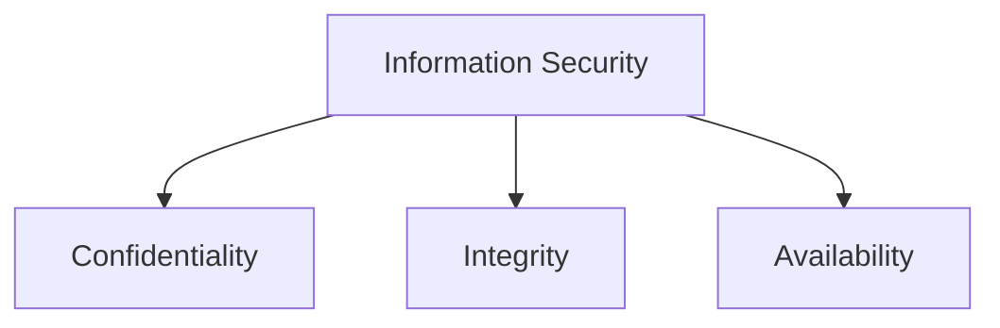

**Quick Reference Table:**

| Aspect          | Detail                                             |
| --------------- | -------------------------------------------------- |
| Confidentiality | Prevents unauthorized disclosure of information.   |
| Integrity       | Prevents unauthorized modification of information. |
| Availability    | Ensures information is accessible when needed.     |

**Key Points:**

- These three principles often conflict.
- Security measures aim to balance them.

---

### Substitution vs. Transposition Ciphers

**Concept:**
The two fundamental types of classical ciphers.

**Visual Representation:**

```mermaid
graph TD
    A[Classical Ciphers] --> B[Substitution]
    A --> C[Transposition]
    B --> D[Replace characters (e.g., Caesar)]
    C --> E[Rearrange characters (e.g., Rail Fence)]
```

**Quick Reference Table:**

| Type          | Action           | Example                |
| ------------- | ---------------- | ---------------------- |
| Substitution  | Replaces letters | Caesar, Playfair, Hill |
| Transposition | Permutes letters | Rail Fence, Columnar   |

**Key Points:**

- Substitution changes the identity of characters.
- Transposition changes the position of characters.

---

### Playfair Cipher Rules

**Concept:**
A digraph substitution cipher using a 5x5 key table.

**Visual Representation:**

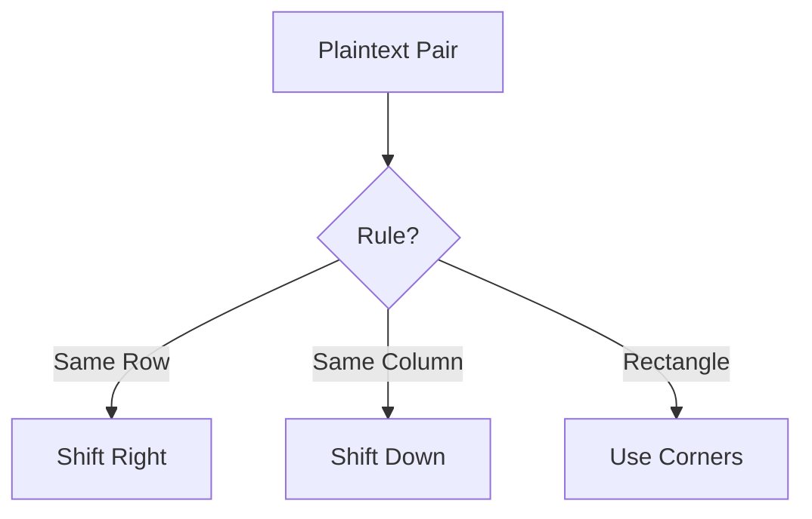

**Quick Reference Table:**

| Condition                | Action                                                    |
| ------------------------ | --------------------------------------------------------- |
| Letters in same row      | Replace with letters to the right (wrap around).          |
| Letters in same column   | Replace with letters below (wrap around).                 |
| Letters form a rectangle | Replace with letters on the same row at the other corner. |

**Key Points:**

- Encrypts pairs of letters (digraphs).
- Key table is a 5x5 grid based on a keyword.
- I and J are usually treated as the same letter.

---

### Hill Cipher Encryption

**Concept:**
A polygraphic substitution cipher using linear algebra.

**Visual Representation:**

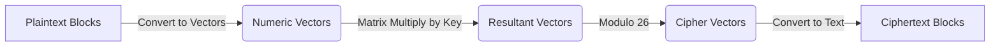

**Quick Reference Table:**

| Step       | Formula              |
| ---------- | -------------------- |
| Encryption | C = K × P (mod 26)   |
| Decryption | P = K⁻¹ × C (mod 26) |

**Key Points:**

- Key is an invertible square matrix.
- Vulnerable to known-plaintext attacks.

---

## Unit 2: Symmetric Ciphers

### Feistel Cipher Structure

**Concept:**
A symmetric structure used in many block ciphers (like DES). It splits the block into two halves and processes them through multiple rounds.

**Visual Representation:**

```mermaid
flowchart TD
    A[Plaintext Block] --> B(Split into L0, R0)
    B --> C{Round 1}
    C --> D(L1 = R0)
    C --> E(R1 = L0 ⊕ F(R0, K1))
    D & E --> F{Round 2..15}
    F --> G{Round 16}
    G --> H(L16 = R15)
    G --> I(R16 = L15 ⊕ F(R15, K16))
    H & I --> J(Swap Halves)
    J --> K[Ciphertext Block]
```

**Quick Reference Table:**

| Component | Description                           |
| --------- | ------------------------------------- |
| L / R     | Left and Right halves of the block.   |
| F         | The "round function" or "F-function". |
| K         | The subkey for the current round.     |
| ⊕         | Bitwise XOR operation.                |

**Key Points:**

- The same algorithm can be used for encryption and decryption by reversing the key schedule.
- The F-function does not need to be invertible.

---

### DES (Data Encryption Standard) Round

**Concept:**
The core processing unit of DES, which applies the F-function to the right half of the data.

**Visual Representation:**

```mermaid
flowchart LR
    A[Rᵢ₋₁ (32-bit)] -- F-Function --> B
    subgraph B [F(Rᵢ₋₁, Kᵢ)]
        C[Expansion E-box] --> D{XOR with Kᵢ}
        D --> E[S-Boxes]
        E --> F[Permutation P-box]
    end
    G[Lᵢ₋₁ (32-bit)] --> H{XOR}
    B --> H
    H --> I[Rᵢ (32-bit)]
    A --> J[Lᵢ (32-bit)]
```

**Quick Reference Table:**

| Parameter  | Value               |
| ---------- | ------------------- |
| Block Size | 64 bits             |
| Key Size   | 56 bits (effective) |
| Rounds     | 16                  |
| Structure  | Feistel             |

**Key Points:**

- S-boxes provide the core non-linearity and confusion.
- Expansion E-box creates diffusion.
- Considered insecure today due to small key size.

---

### AES (Advanced Encryption Standard) Round

**Concept:**
AES is a substitution-permutation network (SPN) that processes a 128-bit block of data in rounds.

**Visual Representation:**

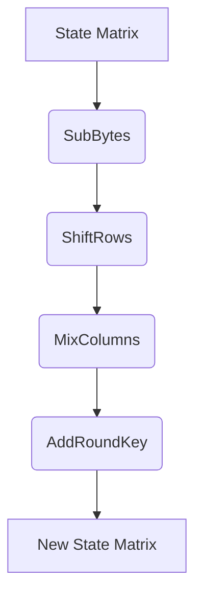

**Quick Reference Table:**

| Step        | Purpose                                |
| ----------- | -------------------------------------- |
| SubBytes    | Non-linear substitution for confusion. |
| ShiftRows   | Permutation for diffusion.             |
| MixColumns  | Matrix multiplication for diffusion.   |
| AddRoundKey | XORs the state with the round key.     |

**Key Points:**

- The final round omits the MixColumns step.
- Key size can be 128, 192, or 256 bits, determining the number of rounds (10, 12, or 14).

---

### Block Cipher Modes of Operation

**Concept:**
Techniques to securely encrypt multiple blocks of plaintext using a block cipher.

**Visual Representation:**

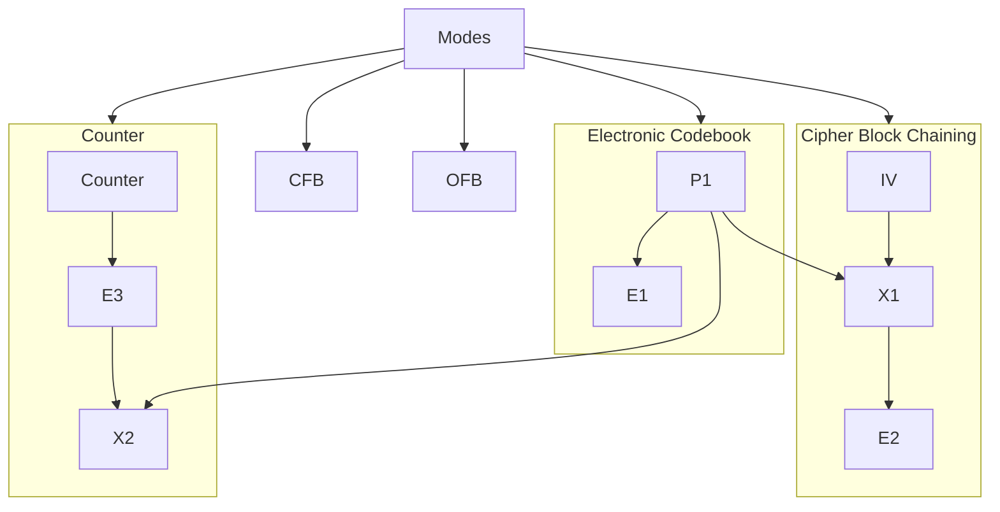

**Quick Reference Table:**

| Mode | Description                                | Use Case                               |
| ---- | ------------------------------------------ | -------------------------------------- |
| ECB  | Each block encrypted independently.        | Insecure, leaks patterns. Avoid.       |
| CBC  | Each block XORed with previous ciphertext. | General-purpose block encryption.      |
| CFB  | Turns block cipher into a stream cipher.   | Stream data encryption.                |
| OFB  | Turns block cipher into a stream cipher.   | Stream data over noisy channels.       |
| CTR  | Encrypts a counter; XORs with plaintext.   | High-speed, parallelizable encryption. |

**Key Points:**

- ECB is deterministic and should not be used.
- CBC, CFB, and OFB require an Initialization Vector (IV).
- CTR mode is highly parallelizable for high performance.

---

## Unit 3: Asymmetric Ciphers

### RSA Algorithm Flow

**Concept:**
An asymmetric algorithm for encryption and digital signatures, based on the difficulty of factoring large numbers.

**Visual Representation:**

```mermaid
flowchart TD
    subgraph Key Generation
        A[Choose primes p, q] --> B(n = p*q)
        A --> C(φ(n) = (p-1)(q-1))
        C --> D(Choose e)
        D --> E(Compute d)
    end
    subgraph Encryption
        F[Plaintext M] --> G{C = M^e mod n}
        G --> H[Ciphertext C]
    end
    subgraph Decryption
        H --> I{M = C^d mod n}
        I --> F
    end
```

**Quick Reference Table:**

| Component   | Formula       |
| ----------- | ------------- |
| Public Key  | (e, n)        |
| Private Key | (d, n)        |
| Encryption  | C = M^e mod n |
| Decryption  | M = C^d mod n |

**Key Points:**

- Security relies on the difficulty of factoring `n` into `p` and `q`.
- `e` and `φ(n)` must be coprime.
- `d` is the modular multiplicative inverse of `e` modulo `φ(n)`.

---

### Diffie-Hellman Key Exchange

**Concept:**
A method for two parties to securely establish a shared secret over an insecure channel.

**Visual Representation:**

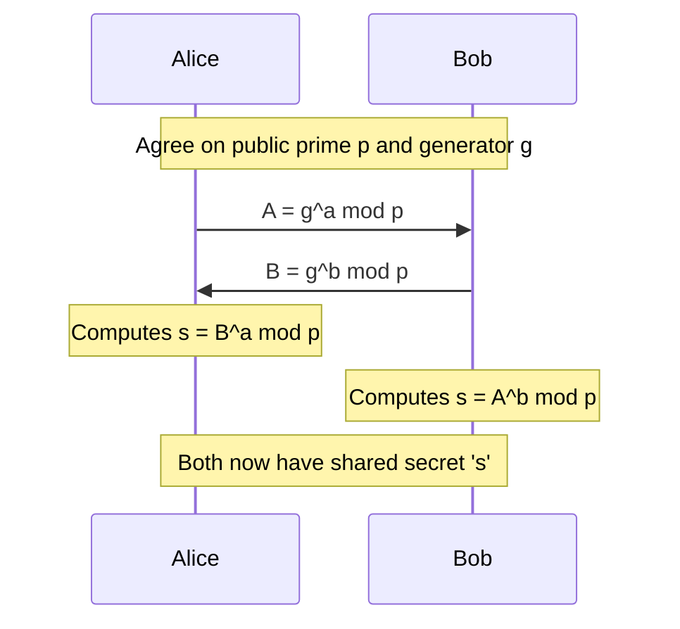

**Quick Reference Table:**

| Party | Private Value | Public Value  | Shared Secret Calculation |
| ----- | ------------- | ------------- | ------------------------- |
| Alice | a             | A = g^a mod p | s = B^a mod p             |
| Bob   | b             | B = g^b mod p | s = A^b mod p             |

**Key Points:**

- Vulnerable to a Man-in-the-Middle (MITM) attack if the public values are not authenticated.
- The shared secret `s` can be used to derive a symmetric key.

---

### Man-in-the-Middle (MITM) Attack on Diffie-Hellman

**Concept:**
An attacker intercepts the public keys and establishes separate shared secrets with each party, tricking them into thinking they are communicating securely.

**Visual Representation:**

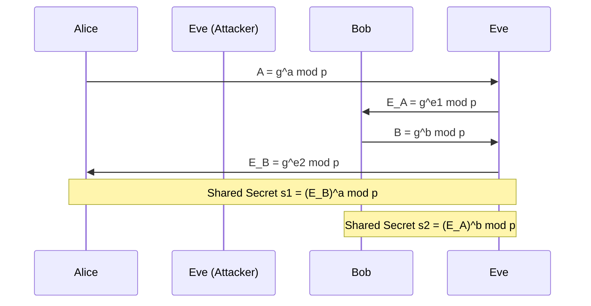

**Key Points:**

- Alice and Bob are unaware of Eve's presence.
- Eve can decrypt, read, and re-encrypt all messages between Alice and Bob.
- Prevented by authenticating the public keys (e.g., using digital signatures).

---

## Unit 4: Hash Functions and Digital Signatures

### Cryptographic Hash Function Properties

**Concept:**
A hash function maps arbitrary-sized data to a fixed-size output (the hash). Cryptographic hash functions have specific security properties.

**Visual Representation:**

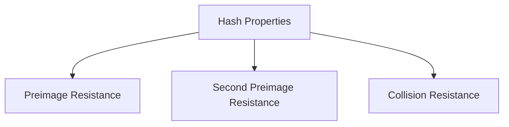

**Quick Reference Table:**

| Property                   | Description                                                                                | Implication                                                      |
| -------------------------- | ------------------------------------------------------------------------------------------ | ---------------------------------------------------------------- |
| Preimage Resistance        | Given a hash `h`, it is hard to find a message `m` such that H(m) = h.                     | One-way property.                                                |
| Second Preimage Resistance | Given a message `m1`, it is hard to find a different message `m2` such that H(m1) = H(m2). | Prevents forgery for a specific message.                         |
| Collision Resistance       | It is hard to find any two different messages `m1` and `m2` such that H(m1) = H(m2).       | Strongest property; prevents finding any two colliding messages. |

**Key Points:**

- Hash functions are fundamental to data integrity and digital signatures.
- Examples: SHA-256, SHA-3.

---

### Digital Signature Process

**Concept:**
A mechanism to verify the authenticity and integrity of a digital message, using asymmetric cryptography.

**Visual Representation:**

```mermaid
flowchart TD
    subgraph Sender (Signing)
        A[Message] --> B{Hash Function}
        B --> C[Hash Digest]
        D[Sender's Private Key] --> E{Encryption}
        C --> E
        E --> F[Digital Signature]
        A & F --> G[Signed Message]
    end
    subgraph Receiver (Verification)
        G --> H[Separate Message and Signature]
        H --> I[Message] & J[Signature]
        I --> K{Hash Function}
        K --> L[Hash Digest 1]
        J --> M{Decryption}
        N[Sender's Public Key] --> M
        M --> O[Hash Digest 2]
        L & O --> P{Compare}
        P --> Q{Valid or Invalid}
    end
```

**Key Points:**

- The sender signs the _hash_ of the message, not the entire message.
- Provides integrity, authenticity, and non-repudiation.

---

## Unit 5: Authentication

### Kerberos Authentication Protocol

**Concept:**
A network authentication protocol that uses tickets to allow nodes to prove their identity over an insecure network.

**Visual Representation:**

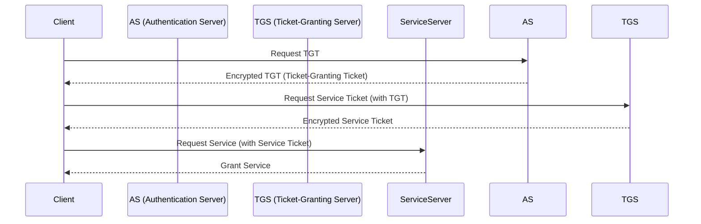

**Quick Reference Table:**

| Component | Full Name               | Role                                                    |
| --------- | ----------------------- | ------------------------------------------------------- |
| AS        | Authentication Server   | Verifies user identity initially.                       |
| TGS       | Ticket-Granting Server  | Issues tickets for specific services.                   |
| TGT       | Ticket-Granting Ticket  | Proves to the TGS that the user has been authenticated. |
| KDC       | Key Distribution Center | Comprises the AS and TGS.                               |

**Key Points:**

- Relies on a trusted third party (the KDC).
- Avoids sending passwords over the network.

---

## Unit 6: Network Security and PKI

### Firewall Types

**Concept:**
Firewalls are network security devices that monitor and filter incoming and outgoing network traffic based on an organization's previously established security policies.

**Visual Representation:**

```mermaid
graph TD
    A[Firewall Types] --> B[Packet Filtering]
    A --> C[Stateful Inspection]
    A --> D[Application Level (Proxy)]
    A --> E[Circuit Level]
    A --> F[Next-Gen (NGFW)]
```

**Quick Reference Table:**

| Type                | Operates at Layer | Description                                                                                        |
| ------------------- | ----------------- | -------------------------------------------------------------------------------------------------- |
| Packet Filtering    | Network (L3)      | Examines packet headers (IP, port). Fast but basic.                                                |
| Stateful Inspection | Transport (L4)    | Tracks the state of connections. More secure than packet filtering.                                |
| Application Level   | Application (L7)  | Acts as a proxy, understands protocols (HTTP, FTP). Very secure but can be slow.                   |
| Circuit Level       | Session (L5)      | Verifies TCP handshakes. Doesn't inspect content.                                                  |
| NGFW                | Multiple Layers   | Combines traditional features with advanced threat prevention (e.g., IPS, deep packet inspection). |

---

### Public Key Infrastructure (PKI) Trust Models

**Concept:**
The arrangement of Certificate Authorities (CAs) that allows entities to trust each other's digital certificates.

**Visual Representation:**

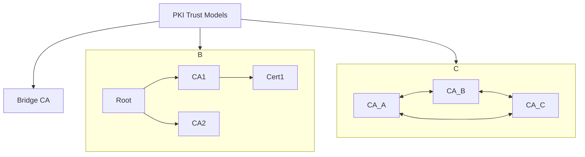

**Key Points:**

- **Hierarchy:** A single root CA is the ultimate trust anchor. Simple but has a single point of failure.
- **Mesh:** CAs trust each other in a peer-to-peer manner. More resilient but complex to manage.
- **Bridge CA:** A central hub that connects multiple PKI hierarchies.

---

### SSL/TLS Handshake

**Concept:**
The process by which a client and server establish a secure connection, including negotiating cipher suites and generating session keys.

**Visual Representation:**

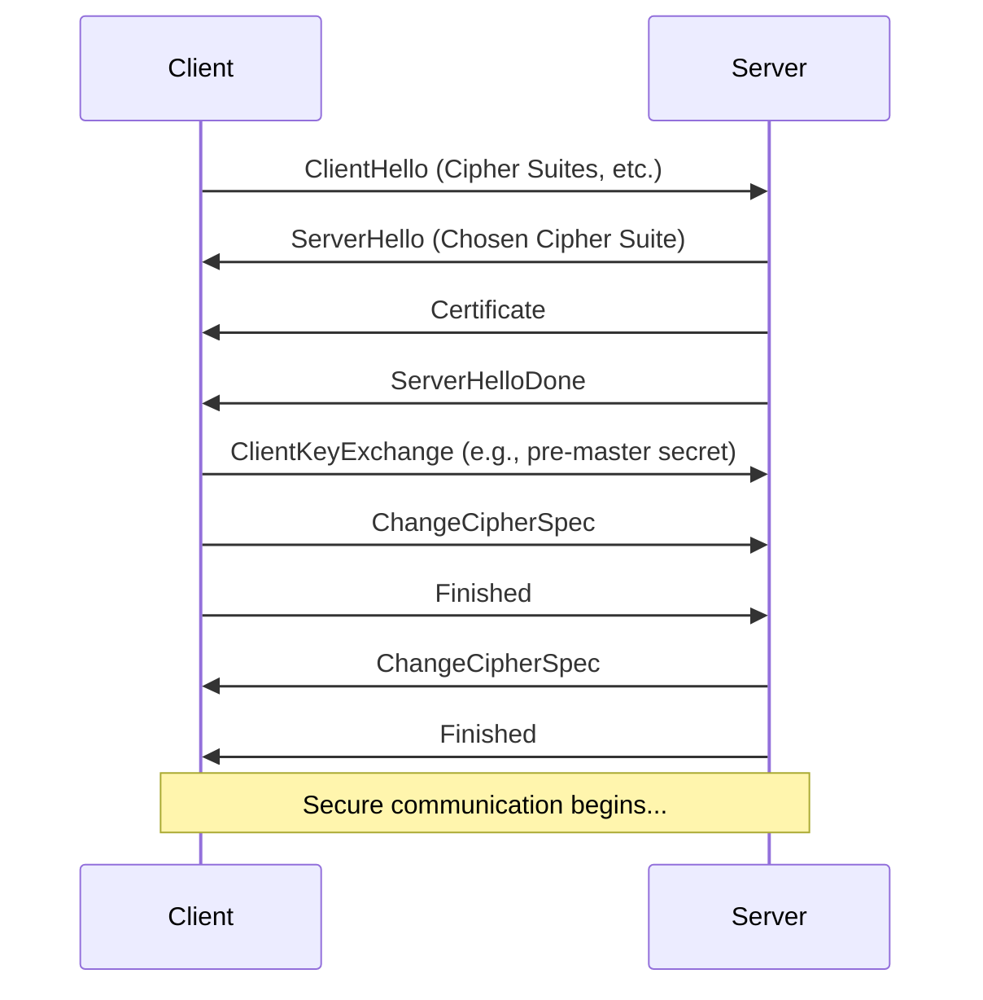

**Key Points:**

- The handshake authenticates the server (and optionally the client).
- It results in a shared symmetric key (the session key) for encrypting application data.

---

## Comparison Charts

### Symmetric vs. Asymmetric Encryption

**Visual Comparison:**

```mermaid
graph TD
    A[Cryptography] --> B[Symmetric]
    A --> C[Asymmetric]
    B --> D[One Shared Key]
    B --> E[Fast]
    B --> F[Use: Bulk Data Encryption]
    C --> G[Two Keys (Public/Private)]
    C --> H[Slow]
    C --> I[Use: Key Exchange, Digital Signatures]
```

**Table Format:**

| Feature            | Symmetric Encryption                    | Asymmetric Encryption                            |
| ------------------ | --------------------------------------- | ------------------------------------------------ |
| **Key**            | One shared secret key                   | A public key and a private key                   |
| **Speed**          | Fast                                    | Slow                                             |
| **Key Management** | Difficult (distribution is a challenge) | Easier (public key can be shared openly)         |
| **Primary Use**    | Encrypting large amounts of data        | Key exchange, digital signatures, authentication |
| **Examples**       | DES, AES, IDEA                          | RSA, Diffie-Hellman, ECC                         |

---

### DES vs. AES

**Visual Comparison:**

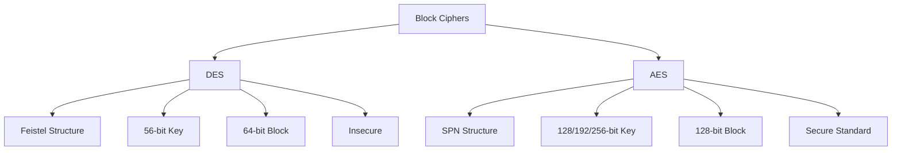

**Table Format:**

| Feature        | DES (Data Encryption Standard)                | AES (Advanced Encryption Standard)                |
| -------------- | --------------------------------------------- | ------------------------------------------------- |
| **Structure**  | Feistel Network                               | Substitution-Permutation Network (SPN)            |
| **Block Size** | 64 bits                                       | 128 bits                                          |
| **Key Size**   | 56 bits                                       | 128, 192, or 256 bits                             |
| **Rounds**     | 16                                            | 10, 12, or 14                                     |
| **Security**   | Considered broken, vulnerable to brute-force. | Considered secure, the current industry standard. |
| **Speed**      | Slower in software                            | Faster in both software and hardware.             |

---

## Quick Revision Section

### Algorithm Flowchart Summary

**RSA Key Generation:**

```mermaid
flowchart TD
    A[Select p, q] --> B(n=p*q, φ=(p-1)(q-1)) --> C(Select e) --> D(Compute d) --> E[Keys: (e,n), (d,n)]
```

**Digital Signature (Signing):**

```mermaid
flowchart TD
    A[Message] --> B(Hash) --> C(Encrypt Hash with Private Key) --> D[Signature]
```

**Digital Signature (Verification):**

```mermaid
flowchart TD
    A[Message] --> B(Hash)
    C[Signature] --> D(Decrypt with Public Key)
    B & D --> E{Compare Hashes}
```

### One-Page Reference Table

| Concept               | Key Idea                            | Example/Use                    |
| --------------------- | ----------------------------------- | ------------------------------ |
| **Playfair Cipher**   | 5x5 grid, encrypts digraphs         | Classical substitution         |
| **Hill Cipher**       | Matrix multiplication mod 26        | Polygraphic substitution       |
| **DES**               | 16-round Feistel cipher, 56-bit key | Legacy symmetric encryption    |
| **AES**               | SPN cipher, 128-bit blocks          | Modern symmetric standard      |
| **RSA**               | Asymmetric, based on factoring      | Encryption, digital signatures |
| **Diffie-Hellman**    | Securely establish a shared secret  | Key exchange                   |
| **SHA-256**           | Cryptographic hash function         | Data integrity, signatures     |
| **Digital Signature** | Hash then encrypt with private key  | Authenticity, non-repudiation  |
| **Kerberos**          | Ticket-based authentication         | Network authentication         |
| **Firewall**          | Filters network traffic             | Network security policy        |
| **SSL/TLS**           | Secures client-server communication | HTTPS, secure web browsing     |
| **PKI**               | Manages digital certificates        | Establishes trust              |
