# Cryptography - Detailed Q&A by GPT-5

## Overview

**Total Topics Covered:** 36
**High-Frequency Questions:** 28
**Word Count:** ~10,000 words

This document compiles the most frequent and important questions from the question papers (years 2076, 2078, 2079, 2080, 2081, 2082, and the Model paper) and organizes them by syllabus units. For each high-frequency topic, you will find a clear question statement, an in-depth answer in simple language, step-by-step worked examples, diagrams where useful, common mistakes, and exam tips.

---

## Unit 1: Introduction and Classical Ciphers

### Topic 1.1: Playfair Cipher

**Frequency:** 5/7 papers

#### Question: Encrypt/decrypt a given message using Playfair cipher with the specified keyword

**Answer:**

Playfair is a classical digraph substitution cipher. It uses a 5×5 key table derived from a keyword (I/J usually combined). Encryption proceeds by splitting plaintext into pairs and applying rules.

**Steps:**

1. Prepare the keyword: remove duplicates, map J→I (if specified).
2. Create 5×5 table with keyword letters, then remaining alphabet.
3. Prepare plaintext: remove spaces, map J→I, split into digraphs; insert filler (X) when a pair has same letter or for odd length.
4. For each pair:
   - Same row: replace each with letter to the right (wrap around).
   - Same column: replace each with letter below (wrap around).
   - Rectangle: replace each with letter in same row but column of the other (i.e., corners of rectangle).

**Example:**
Keyword: "GALOIS" → Table (I/J merged)

Table construction (letters filled row-wise):
G A L O I
S B C D E
F H K M N
P Q R T U
V W X Y Z

Plaintext: "IMOGUN" → I M O G U N
Pairs: IM | OG | UN

- IM: I and M form rectangle with corners I(M row col), M(I row col). I at (1,5), M at (3,4).
  Rectangle mapping → (1,4)=O and (3,5)=N → ON
- OG: O(1,4) and G(1,1) same row → shift right: O→I (wrap to col5), G→A → IA
- UN: U(4,5) and N(3,5) same column → shift down: U→Z (wrap to row5 col5), N→U (row4 col5) → ZU

Ciphertext: ONIAZU.

**Mermaid Diagram:**

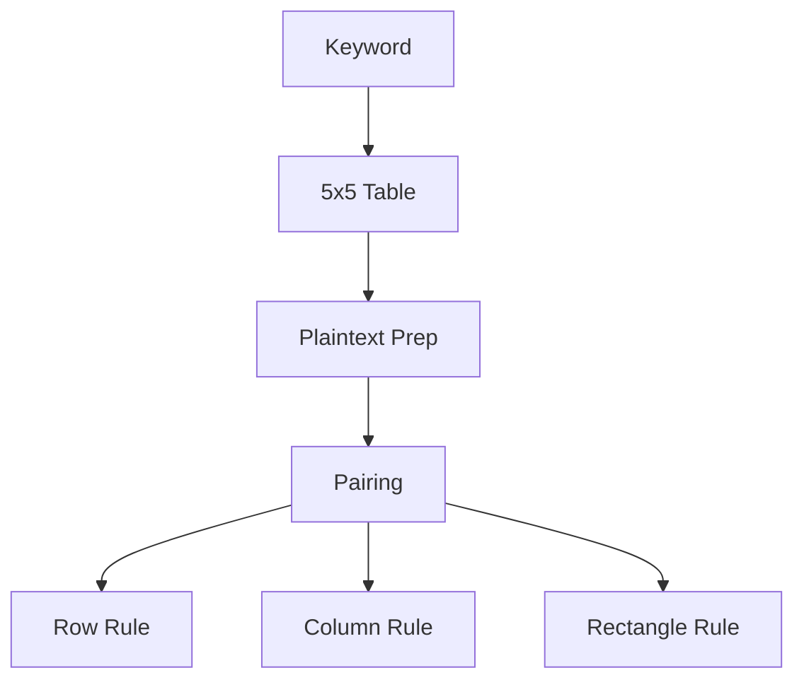

**Common Mistakes:**

- Forgetting to handle repeated letters in a pair (e.g., LL). Use filler X.
- Not wrapping around at table edges.
- Mixing I/J mapping inconsistently.

**Exam Tips:**

- Draw the 5×5 table clearly and label rows/columns.
- Show step-wise pairing and rule application.
- If decrypting, reverse the shift directions (left/up).

---

### Topic 1.2: Hill Cipher

**Frequency:** 5/7 papers

#### Question: Encrypt/decrypt using Hill cipher with a given key matrix; sometimes compute inverse

**Answer:**

Hill cipher is a linear algebra-based cipher. Plaintext blocks are converted to numeric vectors (A=0, B=1, …, Z=25). Ciphertext is computed with matrix multiplication modulo 26.

**Steps (2×2 case):**

1. Convert plaintext into vectors of size 2.
2. Key matrix K = [[a, b], [c, d]].
3. Encrypt: C = K × P (mod 26).
4. Decrypt: P = K^{-1} × C (mod 26), where K^{-1} = (1/ det(K)) × adj(K) mod 26.
   - det(K) = ad − bc; ensure gcd(det(K), 26)=1.
   - Compute modular inverse of det(K) modulo 26.

**Example (Encrypt):**
Key K = [[3, 7], [5, 12]]; plaintext "GVPJ" (G=6,V=21,P=15,J=9) → blocks [6,21], [15,9].

Block1: C1 = [[3,7],[5,12]] × [6,21] = [3*6+7*21, 5*6+12*21] = [18+147, 30+252] = [165, 282] mod 26.
165 mod 26 = 165 − 6*26 = 165 − 156 = 9 → J.
282 mod 26 = 282 − 10*26 = 22 → W.
So C1 = [9,22] → J W.

Block2: [15,9] → C2 = [3*15+7*9, 5*15+12*9] = [45+63, 75+108] = [108, 183].
108 mod 26 = 4 → E. 183 mod 26 = 183 − 7\*26 = 183 − 182 = 1 → B.
Ciphertext: JWEB.

**Mermaid Diagram:**

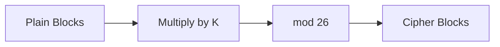

**Common Mistakes:**

- Not reducing modulo 26 at each step.
- Using a non-invertible key (det not coprime with 26).
- Wrong letter-to-number mapping.

**Exam Tips:**

- Write numeric conversions clearly.
- Show intermediate sums to avoid arithmetic mistakes.
- If asked to decrypt, compute K^{-1} carefully with modular inverse.

---

### Topic 1.3: Rail Fence Cipher

**Frequency:** 4/7 papers

#### Question: Encrypt a message using Rail Fence cipher with a specified number of rails

**Answer:**

Rail Fence is a transposition cipher that writes plaintext in a zig-zag across rails and reads row-wise.

**Steps:**

1. Choose number of rails r.
2. Write message in zig-zag: down from rail 1 to r, then up to 1, repeating.
3. Read row-wise to form ciphertext.

**Example:**
Message: "WE ARE IN SAME RACE UNTILL OVER LIVE END" (remove spaces) → "WEAREINSAMERACEUNTILLOVERLIVEEND"
Rails: r = 4.

Zig-zag writing (conceptually):
Row1: W . . . R . . . S . . . R . . . L . . . V . . . N . . .
Row2: . E . A . E . N . A . E . U . I . O . E . I . E . D .
Row3: . . A . R . I . M . C . T . L . V . R . V . . .
Row4: . . . R . . . S . . . E . . . L . . . O . . . E . . .

Concatenate rows to get ciphertext.

**Mermaid Diagram:**

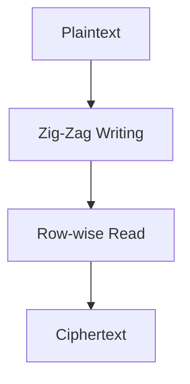

**Common Mistakes:**

- Losing track of zig-zag positions.
- Keeping spaces/punctuation (usually removed).

**Exam Tips:**

- Draw a grid with rows and mark positions.
- If time is short, compute with smaller chunks.

---

### Topic 1.4: Substitution vs Transposition; Monoalphabetic vs Polyalphabetic; CIA Triad

**Frequency:** 2–3/7 papers

#### Question: Differentiate substitution and transposition; compare monoalphabetic and polyalphabetic; define CIA triad

**Answer:**

- Substitution: Replace characters with others (e.g., Caesar, monoalphabetic).
- Transposition: Rearrange positions of characters (e.g., Rail Fence).
- Monoalphabetic: Single mapping throughout; vulnerable to frequency analysis.
- Polyalphabetic: Multiple mappings (e.g., Vigenere); more resistant.

CIA Triad:

- Confidentiality: Only authorized access to information.
- Integrity: Information not altered improperly.
- Availability: Accessible when needed.

**Common Mistakes:**

- Calling DES a stream cipher (it is block).
- Confusing substitution with transposition.

**Exam Tips:**

- Use two clear examples for each category.
- Write concise definitions.

---

## Unit 2: Symmetric Ciphers

### Topic 2.1: DES – Round, F Function, S-Boxes, Weak Keys

**Frequency:** 5/7 papers

#### Question: Explain single round of DES and the F function with S-Boxes; identify weak keys

**Answer:**

DES is a 16-round Feistel cipher operating on 64-bit blocks with a 56-bit effective key. Each round uses the F function.

**DES Round Overview:**

- Input: (L*{i-1}, R*{i-1}).
- Subkey K_i (48-bit) derived from key schedule.
- Compute: L*i = R*{i-1}; R*i = L*{i-1} ⊕ F(R\_{i-1}, K_i).

**F Function Steps:**

1. Expansion E: Expand 32-bit R to 48 bits.
2. XOR with subkey: B = E(R) ⊕ K_i.
3. S-Box substitution: Split B into eight 6-bit blocks; each S-Box outputs 4 bits.
4. Permutation P: Permute 32-bit concatenation of S-Box outputs.

Weak Keys: Certain keys produce identical subkeys across rounds, making encryption reversible or insecure (e.g., all-0s, all-1s patterns). Meet-in-the-middle attacks target 2DES; 3DES mitigates.

**Example:**
Given R\_{i-1} and K_i, show E(R), XOR, S-Box indexing (row from first+last bits, column from middle four), get outputs and permute.

**Mermaid Diagram:**

```mermaid
flowchart LR
    A[R_{i-1} (32-bit)] --> B[Expansion E (48-bit)]
    B --> C[XOR with K_i]
    C --> D[S-Boxes]
    D --> E[Permutation P]
    E --> F[F(R_{i-1}, K_i) (32-bit)]
```

**Common Mistakes:**

- Wrong S-Box indexing (mixing row/column bits).
- Forgetting final P permutation.

**Exam Tips:**

- Draw the Feistel round diagram.
- Use a small numeric example to illustrate S-Box lookup.

---

### Topic 2.2: AES – Key Expansion, MixColumns, S-Box

**Frequency:** 6/7 papers

#### Question: Explain AES key expansion and MixColumns; compute next key bytes using given S-Box.

**Answer:**

AES is a block cipher with 128-bit blocks and key sizes 128/192/256. It uses rounds with SubBytes, ShiftRows, MixColumns, AddRoundKey.

**Key Expansion (AES-128):**

- Input key: 16 bytes, make 4 words (w0..w3).
- Generate w4..w43; every 4th word applies RotWord, SubWord, and XOR with round constant Rcon.

**MixColumns:**

- Operates on each column (4 bytes) in state using GF(2^8) multiplication by fixed matrix:
  [2 3 1 1; 1 2 3 1; 1 1 2 3; 3 1 1 2].

**Example (Key Expansion):**
Given key bytes and S-Box, compute next 4 bytes:

- RotWord: cyclic shift of 4-byte word.
- SubWord: apply S-Box to each byte.
- XOR with Rcon and previous word.

**Mermaid Diagram:**

```mermaid
flowchart TD
    A[Key (w0..w3)] --> B[Generate w4..w43]
    B --> C[RotWord/SubWord/Rcon]
    C --> D[XOR chain]
```

**Common Mistakes:**

- Forgetting Rcon application every Nk-th word.
- Wrong GF(2^8) multiplication in MixColumns.

**Exam Tips:**

- Show each byte transform explicitly.
- For MixColumns, write intermediate XORs clearly.

---

### Topic 2.3: Modes of Block Cipher (ECB, CBC, CFB, OFB, CTR)

**Frequency:** 4/7 papers

#### Question: Explain block cipher modes and their differences.

**Answer:**

- ECB: Encrypts blocks independently; simple but leaks patterns.
- CBC: Chains blocks with IV; better confidentiality.
- CFB/OFB: Turn block cipher into stream-like modes; handle partial data.
- CTR: Uses counter-generated keystream; parallelizable.

**Mermaid Diagram:**

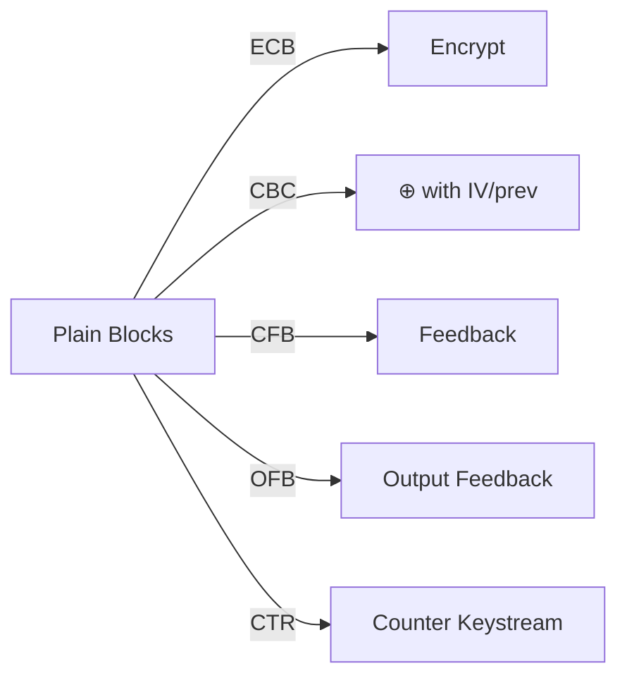

**Common Mistakes:**

- Confusing IV requirement and reuse rules.

**Exam Tips:**

- Provide one line for when each mode is used.
- Mention error propagation and parallelism.

---

### Topic 2.4: IDEA Algorithm – Round Operation

**Frequency:** 3/7 papers

#### Question: Trace the first full round of IDEA with given 4-bit keys and input.

**Answer:**

IDEA uses 8 rounds with operations: modular multiplication mod 2^16+1, addition mod 2^16, XOR.

**Round Structure (simplified):**

- Inputs: X1..X4 and subkeys Z1..Z6.
- Compute:
  1. X1' = X1 × Z1 (mod 2^16+1)
  2. X2' = X2 + Z2 (mod 2^16)
  3. X3' = X3 + Z3 (mod 2^16)
  4. X4' = X4 × Z4 (mod 2^16+1)
  5. T1 = X1' ⊕ X3'
  6. T2 = X2' ⊕ X4'
  7. T1' = T1 × Z5 (mod 2^16+1)
  8. T2' = (T1' + T2) × Z6 (mod 2^16+1)
  9. T1'' = T1' + T2' (mod 2^16)
  10. Outputs combined with ⊕ to get new Xs.

**Mermaid Diagram:**

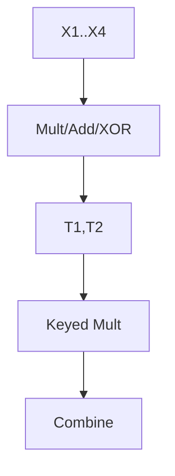

**Common Mistakes:**

- Mixing modulo bases for addition/multiplication.

**Exam Tips:**

- Write modulus next to each operation.
- Keep track of subkey order.

---

### Topic 2.5: Galois Fields and Polynomial Arithmetic

**Frequency:** 3/7 papers

#### Question: Perform division or inverse over GF(p) or GF(2^n); compute GCD using Euclidean/extended Euclidean.

**Answer:**

In GF(p), operations are modulo p. For polynomials over GF(p), coefficients are modulo p.

**Example:** Divide (3x^2 + 4x + 3) by (5x + 6) over GF(7).

- Reduce coefficients mod 7: numerator = 3x^2 + 4x + 3; denominator = 5x + 6.
- Compute inverse of leading coeff of denominator: inverse of 5 mod 7 is 3 (since 5×3=15≡1).
- Perform long division with coeffs mod 7.

**Mermaid Diagram:**

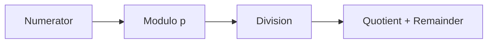

**Common Mistakes:**

- Not reducing intermediate results modulo p.

**Exam Tips:**

- Show each step; mark where mod is applied.

---

## Unit 3: Asymmetric Ciphers

### Topic 3.1: RSA Algorithm (Key Gen, Encrypt/Decrypt)

**Frequency:** 6/7 papers – CRITICAL

#### Question: Explain RSA and solve a complete example (find keys, encrypt, decrypt).

**Answer:**

RSA uses two primes to construct a modulus; relies on difficulty of factoring.

**Key Generation:**

1. Choose primes p, q.
2. Compute n = p×q.
3. Compute φ(n) = (p−1)(q−1).
4. Choose e such that gcd(e, φ(n)) = 1.
5. Compute d such that e×d ≡ 1 (mod φ(n)).

**Encryption:** C = M^e mod n.
**Decryption:** M = C^d mod n.

**Example:** p=13, q=7.

- n = 91; φ(n) = 72.
- Choose e=5 (coprime with 72).
- Find d: Solve 5d ≡ 1 (mod 72). Using extended Euclidean, d=29 (since 5×29=145≡1 mod 72).
- Public key: (e=5, n=91). Private key: (d=29, n=91).
- Encrypt M=8: C = 8^5 mod 91. 8^2=64; 8^4=64^2=4096≡4096−45×91=4096−4095=1; so 8^5=8^4×8≡1×8=8.
- Decrypt: M = 8^29 mod 91. Using Euler's theorem or repeated squaring yields 8.

**Mermaid Diagram:**

```mermaid
flowchart TD
    A[p,q] --> B[n,φ(n)]
    B --> C[e coprime]
    C --> D[d inverse]
    D --> E[Public/Private Keys]
    E --> F[Encrypt]
    E --> G[Decrypt]
```

**Common Mistakes:**

- Computing φ(n) incorrectly.
- Choosing e not coprime with φ(n).
- Forgetting mod n in power steps.

**Exam Tips:**

- Show extended Euclidean steps for d.
- Use modular arithmetic shortcuts (square-and-multiply).

---

### Topic 3.2: Diffie–Hellman Key Exchange

**Frequency:** 5/7 papers

#### Question: Explain secret key sharing; compute private/public keys and shared key; discuss MITM.

**Answer:**

Diffie–Hellman lets two parties agree on a shared secret over insecure channel.

**Steps:**

1. Agree on prime p and generator g.
2. Alice picks private a, sends A = g^a mod p.
3. Bob picks private b, sends B = g^b mod p.
4. Shared secret: s = B^a mod p = A^b mod p.

**Example:** p=13, g=2 (primitive root). A's public=10, B's public=8.
Find a,b: Solve 2^a≡10 mod 13 → a=10 (since 2^10=1024≡10). 2^b≡8 mod 13 → b=3 (2^3=8).
Shared s = 8^10 mod 13 or 10^3 mod 13. 10^3=1000≡1000−76×13=1000−988=12.
Shared key s=12.

MITM Attack: An attacker intercepts A and B, substitutes own public values, establishing separate secrets with each, breaking confidentiality unless authenticated.

**Mermaid Diagram:**

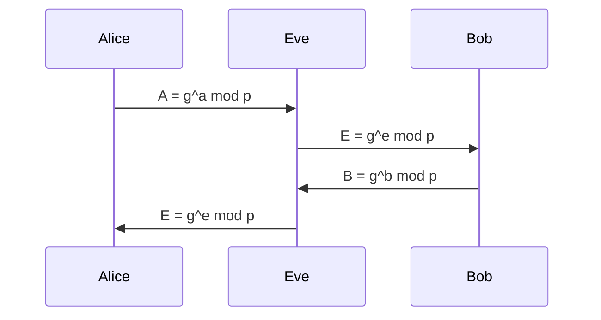

**Common Mistakes:**

- Using non-primitive g causing small cycles.
- Not applying modulus in exponentiation.

**Exam Tips:**

- If asked to compute private keys from publics, use discrete logs with small p.
- Mention need for authentication to prevent MITM.

---

### Topic 3.3: ElGamal Cryptosystem

**Frequency:** 3/7 papers

#### Question: Encrypt a message using ElGamal with given parameters.

**Answer:**

Given prime q, generator α, receiver's public Y=α^X mod q.

**Encryption:**

1. Choose random k.
2. Compute C1=α^k mod q.
3. Compute C2=M×Y^k mod q.
   Ciphertext: (C1, C2).

**Mermaid Diagram:**

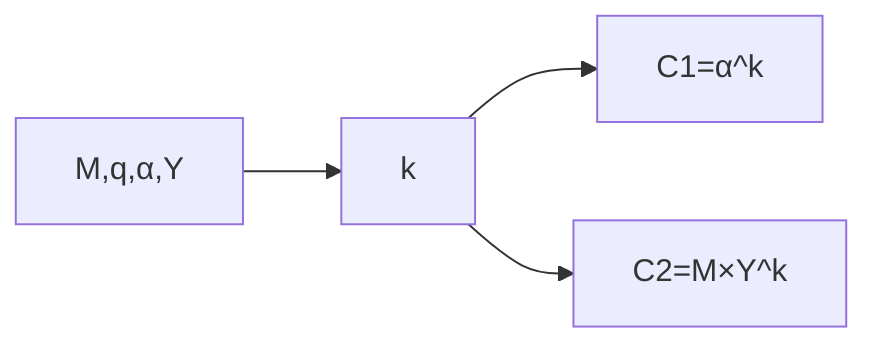

**Common Mistakes:**

- k must be random and fresh; reuse leaks plaintext.

**Exam Tips:**

- Write both components clearly.
- Show modular exponentiation steps.

---

### Topic 3.4: Number Theory Basics (Fermat, Euler, Totient, Primitive Roots, Miller–Rabin)

**Frequency:** 4–5/7 papers

#### Question: Apply Fermat’s theorem; compute totient; test primality; check primitive roots.

**Answer:**

- Fermat: For prime p, a^{p−1} ≡ 1 mod p when gcd(a,p)=1.
- Euler: For n, a^{φ(n)} ≡ 1 mod n when gcd(a,n)=1.
- Totient φ(n): Count of integers less than n and coprime to n. For prime p, φ(p)=p−1; for n=pq, φ(n)=(p−1)(q−1).
- Primitive root: g is primitive modulo p if its powers generate all non-zero residues.
- Miller–Rabin: Probabilistic primality test using witness bases.

**Example:** Find 7^{2019} mod 13.

- φ(13)=12; 2019 mod 12 = 2019−168×12=2019−2016=3; so 7^{2019} ≡ 7^3 ≡ 343 mod 13.
  343−26×13=343−338=5.

**Common Mistakes:**

- Not reducing exponent with φ(n).

**Exam Tips:**

- Use Fermat/Euler to reduce large exponents.
- State conditions (gcd) explicitly.

---

## Unit 4: Hash Functions and Digital Signatures

### Topic 4.1: SHA-1 – Hash Generation

**Frequency:** 4/7 papers

#### Question: Describe how SHA-1 generates a hash; show steps for a small message.

**Answer:**

SHA-1 processes message in 512-bit blocks; outputs 160-bit digest.

**Steps:**

1. Padding: Append 1 bit, then zeros, then 64-bit length to make multiple of 512.
2. Initialize buffers: A,B,C,D,E with constants.
3. For each block, expand 16 words to 80 (W_t) using bitwise operations.
4. For t=0..79, compute temp with functions (Ch, Parity, Maj) and constants K_t; rotate and add.
5. Add block result to buffers.

**Mermaid Diagram:**

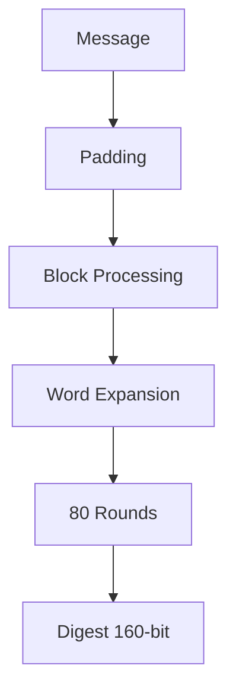

**Common Mistakes:**

- Forgetting length field in padding.
- Mixing functions across rounds.

**Exam Tips:**

- Name functions and constants per round.
- Draw a compact round diagram.

---

### Topic 4.2: MD4 – Passes and Digest Computation

**Frequency:** 3/7 papers

#### Question: Explain MD4 passes and how digest is computed.

**Answer:**

MD4 uses 3 rounds (passes) with non-linear functions and addition modulo 2^32; similar padding to SHA.

**Common Mistakes:**

- Confusing MD4 with MD5/SHA functions.

**Exam Tips:**

- Focus on high-level steps; list function names.

---

### Topic 4.3: Digital Signatures – Direct vs Arbitrated; RSA/DSA Approaches

**Frequency:** 5/7 papers

#### Question: Explain digital signatures; differentiate direct and arbitrated; show RSA/DSA signing.

**Answer:**

Digital signature ensures authenticity, integrity, non-repudiation.

- Direct: Sender signs with private key; receiver verifies with public key.
- Arbitrated: Trusted third party mediates signatures.

**RSA Signing:**

- Sign: S = H(M)^d mod n.
- Verify: Compare H(M) with S^e mod n.

**DSA:**

- Use parameters p,q,g; compute signature pair (r,s) with random k; verify with modular operations.

**Mermaid Diagram:**

```mermaid
flowchart LR
    A[Message M] --> B[Hash H(M)]
    B --> C[Sign with Private]
    C --> D[Signature]
    D --> E[Verify with Public]
```

**Common Mistakes:**

- Encrypting message directly for signature instead of hashing.
- Reusing k in DSA (fatal security flaw).

**Exam Tips:**

- Always mention hashing before signing.
- For DSA, note that k must be random and secret.

---

## Unit 5: Authentication

### Topic 5.1: Authentication System; One-Way vs Mutual; Challenge–Response; Kerberos

**Frequency:** 4/7 papers

#### Question: Define authentication system; explain one-way vs mutual; describe challenge–response and Kerberos.

**Answer:**

- Authentication system: Methods to verify identities.
- One-way: Server verifies client.
- Mutual: Client and server verify each other; prevents MITM.
- Challenge–response: Server sends challenge; client responds using shared secret or private key.
- Kerberos: Centralized authentication using tickets and a Key Distribution Center (KDC).

**Mermaid Diagram:**

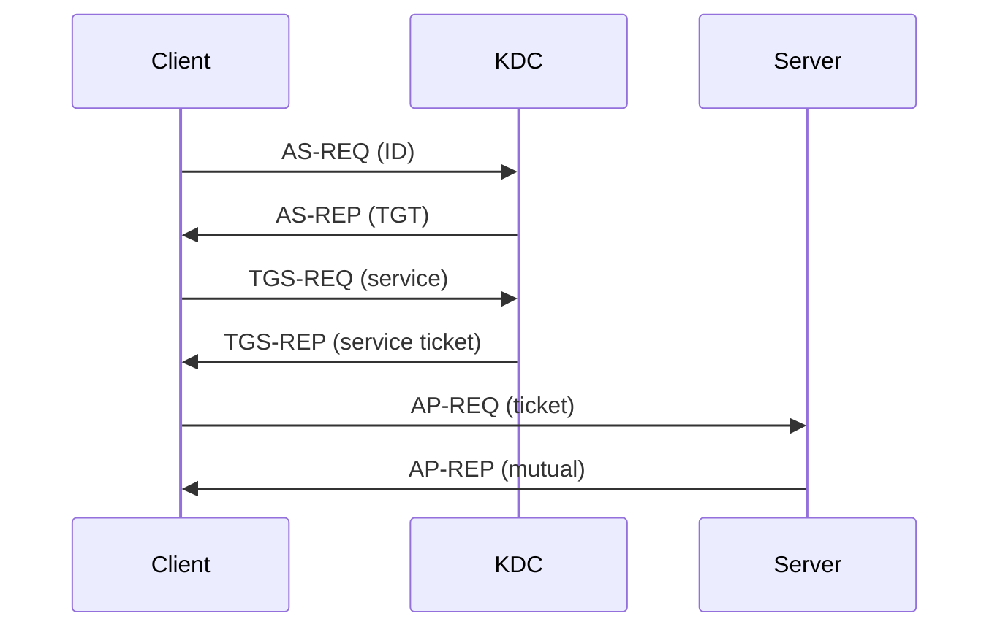

**Common Mistakes:**

- Not distinguishing authorization (access rights) from authentication (identity).

**Exam Tips:**

- Draw Kerberos exchange with message names.

---

## Unit 6: Network Security and PKI

### Topic 6.1: Firewalls – Types and Tasks

**Frequency:** 6/7 papers – CRITICAL

#### Question: What is a firewall; list and explain types.

**Answer:**

Firewall monitors and controls traffic per security policy.

**Types:**

1. Packet Filtering
2. Stateful Inspection
3. Application-Level Gateway (Proxy)
4. Circuit-Level Gateway
5. Next-Generation Firewall
6. NAT Firewall
7. Host-Based Firewall

**Mermaid Diagram:**

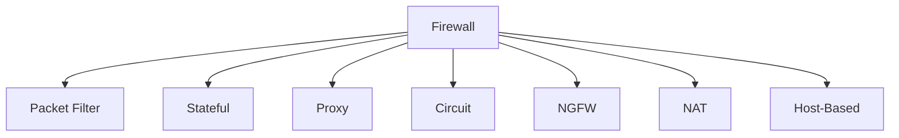

**Common Mistakes:**

- Writing too few types (usually expect ≥5).

**Exam Tips:**

- Provide 1–2 lines describing each.

---

### Topic 6.2: PKI – Trust Models; Digital Certificates; X.509; Certificate Life Cycle; PGP; SSL/TLS; IPSec

**Frequency:** 2–3/7 papers each

#### Question: Explain PKI trust models; list X.509 elements; describe certificate life cycle; PGP services; SSL/TLS; IPSec components.

**Answer:**

- PKI trust models: Hierarchical (single root), Mesh (cross-certified), Bridge CA.
- X.509 certificate elements: Version, Serial Number, Signature Algorithm, Issuer, Validity, Subject, Subject Public Key Info, Extensions.
- Certificate life cycle: Enrollment, Issuance, Use, Renewal, Revocation.
- PGP services: Authentication, Confidentiality, Compression, Email Compatibility, Segmentation.
- SSL/TLS: Handshake, session keys, record protocol.
- IPSec: AH, ESP, SA, IKE, transport/tunnel modes.

**Mermaid Diagram:**

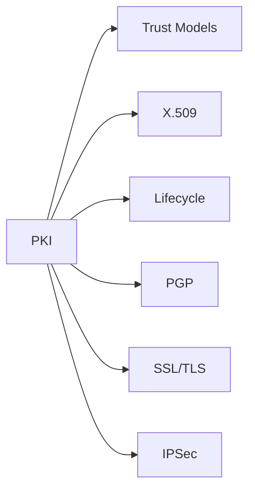

**Common Mistakes:**

- Mixing certificate elements with PGP services.

**Exam Tips:**

- Use bullet lists; be complete.

---

## Unit 7: Malicious Logic and Intrusion

### Topic 7.1: Types of Malicious Logic; Virus vs Worm; Trojan vs Zombies; Intrusion and IDS; DoS

**Frequency:** 4–6/7 papers

#### Question: Describe types of malicious logic; differentiate virus/worm; explain intruders and IDS; define DoS.

**Answer:**

- Virus: Self-replicating code requiring host files.
- Worm: Standalone, spreads over network.
- Trojan: Malicious code hidden in legitimate program.
- Zombies: Compromised machines controlled remotely.
- Intrusion: Unauthorized access attempts; intruder classes: masquerader, misfeasor, clandestine user.
- IDS: Signature-based, anomaly-based; host/network-based.
- DoS: Exhaust resources; examples: SYN flood, UDP flood.

**Mermaid Diagram:**

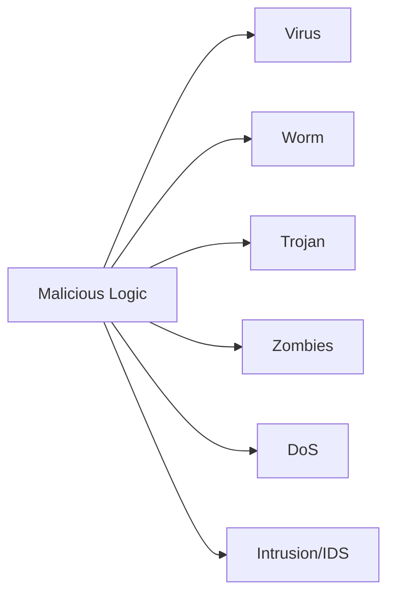

**Common Mistakes:**

- Confusing DoS with DDoS; both deny service, DDoS uses many sources.

**Exam Tips:**

- Provide one concise example for each type.

---

## High-Frequency Question Index (3+ and 2× Appearances)

- Playfair cipher (5×)
- Hill cipher (5×)
- Rail Fence cipher (4×)
- DES round/S-Box/F function (5×)
- AES key expansion/MixColumns (6×)
- Modes of block cipher (4×)
- IDEA round (3×)
- Galois field operations (3×)
- RSA complete problem (6×)
- Diffie–Hellman (5×)
- ElGamal (3×)
- Fermat/Euler/totient (4×)
- SHA-1 (4×)
- MD4 (3×)
- Digital signatures; DSS/DSA/RSA (5×)
- Authentication & Kerberos (4×)
- Firewalls (6×)
- PKI/X.509/PGP/SSL/TLS/IPSec (2–3×)
- Malicious logic/intrusion/IDS/DoS (4–6×)

---

## Exam Strategy Summary

- Prioritize RSA, AES, DES, Diffie–Hellman, classical ciphers, firewalls, SHA-1, and digital signatures.
- For numerical problems, always write formulas and show all steps.
- For theory/list questions, be complete and concise with examples.
- Use diagrams sparingly but effectively for processes (AES, SHA, Kerberos, PKI).

---

## End Notes

This Q&A compiles repeated patterns across years and presents clear, example-driven solutions targeted for bachelor-level understanding. Always cross-check numbers and modulus operations, label diagrams, and manage your exam time.
